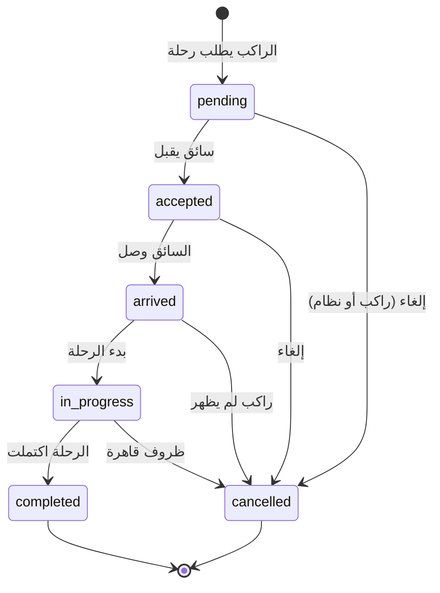

# AI_MASTER_REFERENCE.md

# ران RAAN - الوثيقة المرجعية الشاملة

**آخر تحديث:** 2026-02-24  
**الإصدار:** 2.0.1  
**المُنشئ:** نظام التطوير الذكي

---

> ⚠️ **تحذير للذكاء الاصطناعي:**  
> يجب قراءة هذا الملف **كاملاً** قبل أي تعديل على المشروع.  
> هذا الملف هو **المصدر الوحيد للحقيقة** في المشروع.

---

## 📋 جدول المحتويات

1. [هوية المشروع](#1-هوية-المشروع)
2. [هيكل المشروع](#2-هيكل-المشروع)
3. [هيكل قاعدة البيانات](#3-هيكل-قاعدة-البيانات)
4. [دورة حياة الرحلة](#4-دورة-حياة-الرحلة)
5. [قواعد التسعير](#5-قواعد-التسعير)
6. [قواعد الإرسال للسائقين](#6-قواعد-الإرسال-للسائقين)
7. [المستخدمون والصلاحيات](#7-المستخدمون-والصلاحيات)
8. [الميزات الحالية](#8-الميزات-الحالية)
9. [الميزات المخططة](#9-الميزات-المخططة)
10. [أفكار مرفوضة](#10-أفكار-مرفوضة)
11. [قواعد التطوير](#11-قواعد-التطوير)
12. [سجل التغييرات](#12-سجل-التغييرات)
13. [مهام المستقبل](#13-مهام-المستقبل)

---

## 1. هوية المشروع

### الاسم

**ران RAAN** - تطبيق تاكسي عراقي ذكي

### الرؤية

أن نكون التطبيق الأول والأكثر موثوقية للتنقل في العراق.

### الأهداف الرئيسية

- ✅ توفير خدمة توصيل آمنة وموثوقة
- ✅ دعم السائقين العراقيين وتوفير دخل مستدام
- ✅ تقديم أسعار عادلة وشفافة
- ✅ بناء مجتمع نقل موثوق

### ما ليس من أهدافنا (Non-Goals)

- ❌ لن نكون منصة توصيل طعام (حالياً)
- ❌ لن نقدم خدمات الشحن الكبيرة
- ❌ لن نتنافس على السعر فقط على حساب الجودة
- ❌ لن نسمح بسائقين غير موثقين

### السوق المستهدف

- 🇮🇶 العراق (بغداد أولاً، ثم باقي المحافظات)
- 👥 الفئة العمرية: 18-55 سنة
- 📱 مستخدمو الهواتف الذكية

---

## 2. هيكل المشروع

### التقنيات المستخدمة

| الطبقة | التقنية |
|--------|---------|
| **Frontend** | React 18 + TypeScript + Vite |
| **Styling** | Tailwind CSS + shadcn/ui |
| **State** | React Query + useState |
| **Backend** | Supabase (PostgreSQL + Auth + Realtime) |
| **Maps** | Mapbox GL JS |
| **Animations** | Framer Motion |

### هيكل المجلدات

```
src/
├── components/
│   ├── admin/          # مكونات لوحة الأدمن
│   ├── rider/          # مكونات شاشات الراكب
│   ├── driver/         # مكونات شاشات السائق
│   ├── ui/             # مكونات shadcn/ui
│   └── common/         # مكونات مشتركة
├── pages/
│   ├── admin/          # صفحات الأدمن (24 صفحة)
│   ├── rider/          # صفحات الراكب (7 صفحات)
│   └── driver/         # صفحات السائق (12 صفحة)
├── hooks/              # Custom React Hooks
├── lib/                # Utilities والثوابت
├── integrations/       # Supabase client
└── assets/             # الصور والأيقونات

supabase/
├── migrations/         # ملفات ترحيل قاعدة البيانات (75 ملف)
├── functions/          # Edge Functions
└── *.sql               # ملفات SQL للإصلاح السريع
```

---

## 3. هيكل قاعدة البيانات

### الجداول الأساسية

#### 3.1 profiles (الملفات الشخصية)

```sql
profiles (
  id UUID PRIMARY KEY,
  user_id UUID UNIQUE → auth.users,
  full_name TEXT,
  phone TEXT,
  avatar_url TEXT,
  preferred_language TEXT DEFAULT 'ar',
  created_at, updated_at
)
```

**القيود:** يجب أن يكون الاسم حقيقياً (كلمتين+)، لا أسماء محظورة.

#### 3.2 user_roles (الأدوار)

```sql
user_roles (
  id UUID PRIMARY KEY,
  user_id UUID → auth.users,
  role app_role ENUM('admin', 'moderator', 'user'),
  UNIQUE(user_id, role)
)
```

#### 3.3 drivers (السائقون)

```sql
drivers (
  id UUID PRIMARY KEY,
  user_id UUID UNIQUE → auth.users,
  full_name TEXT NOT NULL,
  phone TEXT NOT NULL,
  license_number, license_image_url, id_image_url,
  vehicle_type ENUM('economy','comfort','premium','women_only'),
  vehicle_model, vehicle_color, vehicle_plate,
  status ENUM('pending','approved','rejected','suspended'),
  is_online BOOLEAN, is_available BOOLEAN,
  current_location JSONB,
  total_earnings, total_rides, rating
)
```

**قاعدة مهمة:** السائق لا يمكنه قبول رحلات إلا إذا: `status='approved' AND is_online=true AND is_available=true`

#### 3.4 rides (الرحلات)

```sql
rides (
  id UUID PRIMARY KEY,
  rider_id UUID → auth.users,
  driver_id UUID → drivers,
  region_id UUID → regions,
  pickup_location JSONB NOT NULL {lat, lng},
  pickup_address TEXT,
  dropoff_location JSONB NOT NULL {lat, lng},
  dropoff_address TEXT,
  vehicle_type, status, 
  estimated_fare INTEGER,
  final_fare INTEGER,
  distance_km, duration_minutes, waiting_minutes,
  payment_method ENUM('cash','zain_cash','asia_hawala','qi_card'),
  rider_rating, driver_rating,
  cancelled_by, cancellation_reason,
  started_at, completed_at
)
```

#### 3.5 regions (المناطق)

```sql
regions (
  id UUID PRIMARY KEY,
  name_ar TEXT NOT NULL,
  name_en, name_ku,
  base_fare INTEGER DEFAULT 2000,
  per_km_fare INTEGER DEFAULT 500,
  waiting_fare_per_min INTEGER DEFAULT 100,
  is_active BOOLEAN,
  coordinates JSONB
)
```

### جداول إضافية

| الجدول | الوظيفة |
|--------|---------|
| `landmarks` | النقاط الدالة (جامعات، مولات...) |
| `referral_codes` | أكواد الإحالة |
| `referrals` | سجل الإحالات |
| `ride_share_links` | روابط مشاركة الرحلة |
| `ride_reviews` | التقييمات المتقدمة |
| `review_tags` | وسوم التقييم |
| `banned_names` | الأسماء المحظورة |
| `ride_matching_log` | سجل مطابقة الرحلات |
| `push_tokens` | توكنات الإشعارات |

---

## 4. دورة حياة الرحلة

### مخطط الحالات



### قواعد الانتقال بين الحالات

| من | إلى | الشرط | المسؤول |
|----|-----|-------|---------|
| - | `pending` | طلب جديد | راكب |
| `pending` | `accepted` | سائق قريب متاح | سائق |
| `pending` | `cancelled` | إلغاء قبل 3 دقائق | راكب (بدون غرامة) |
| `pending` | `cancelled` | لا يوجد سائق متاح بعد 5 دقائق | نظام |
| `accepted` | `arrived` | السائق على بعد <100 متر | سائق |
| `accepted` | `cancelled` | إلغاء بعد القبول | غرامة على المُلغي |
| `arrived` | `in_progress` | الراكب ركب السيارة | سائق |
| `arrived` | `cancelled` | بعد 5 دقائق انتظار | سائق (غرامة على الراكب) |
| `in_progress` | `completed` | الوصول للوجهة | سائق |

### 🚨 قواعد لا يجب كسرها

> [!CAUTION]
>
> - **لا يمكن العودة من `completed` أو `cancelled`**
> - **الرحلة المُلغاة لا يمكن إعادة فتحها**
> - **`in_progress` لا يمكن الرجوع منها لـ `accepted`**

---

## 5. قواعد التسعير

### صيغة حساب الأجرة

```typescript
الأجرة = الأجرة_الأساسية 
       + (المسافة_كم × سعر_الكيلومتر) 
       + (دقائق_الانتظار × سعر_دقيقة_الانتظار)
       × معامل_نوع_السيارة
       × معامل_الذروة
```

### معاملات أنواع السيارات

| النوع | المعامل | الوصف |
|-------|---------|-------|
| `economy` | 1.0 | اقتصادي |
| `comfort` | 1.3 | مريح |
| `premium` | 1.8 | فاخر |
| `women_only` | 1.2 | نسائي |

### تسعير الذروة (Surge Pricing)

| الحالة | المعامل |
|--------|---------|
| طلب عادي | 1.0 |
| طلب مرتفع (>5 دقائق انتظار) | 1.2 |
| ذروة شديدة (مناسبات/أعياد) | 1.3-1.5 |
| حد أقصى | 2.0 |

### 🚨 قواعد لا يجب كسرها

> [!CAUTION]
>
> - **الحد الأدنى للأجرة = الأجرة الأساسية**
> - **لا يمكن تقليل السعر بعد بدء الرحلة**
> - **العمولة 15% ثابتة (قابلة للتعديل بواسطة الأدمن فقط)**

---

## 6. قواعد الإرسال للسائقين

### خوارزمية اختيار السائق

```
1. فلترة السائقين:
   - status = 'approved'
   - is_online = true
   - is_available = true
   - vehicle_type = المطلوب

2. ترتيب حسب:
   - المسافة من نقطة الالتقاء (الأقرب أولاً)
   - التقييم (الأعلى أولاً)
   - عدد الرحلات اليوم (الأقل أولاً للتوزيع العادل)

3. إرسال الطلب:
   - للسائق الأول: 20 ثانية مهلة
   - إذا لم يرد: للسائق التالي
   - حد أقصى 5 سائقين
   - بعد 5 محاولات: إلغاء تلقائي
```

### نطاق البحث

| المحاولة | النطاق |
|----------|--------|
| 1 | 2 كم |
| 2 | 3 كم |
| 3 | 5 كم |
| 4+ | 8 كم |

---

## 7. المستخدمون والصلاحيات

### أنواع المستخدمين

| النوع | الصلاحيات |
|-------|----------|
| **مستخدم عادي (user)** | حجز رحلات، عرض السجل، تقييم |
| **سائق (driver)** | قبول رحلات، تتبع الأرباح، إدارة الحساب |
| **مشرف (moderator)** | عرض التقارير، حل النزاعات |
| **مدير (admin)** | كل الصلاحيات، إدارة النظام |

### Row Level Security (RLS)

جميع الجداول محمية بـ RLS:

- المستخدم يرى بياناته فقط
- السائق يرى رحلاته فقط
- الأدمن يرى الكل

---

## 8. الميزات الحالية

### ✅ مُنجزة

| الميزة | الحالة | التاريخ |
|--------|--------|---------|
| تسجيل دخول بالهاتف (OTP) | ✅ | 2025-12 |
| حجز رحلة من الخريطة | ✅ | 2025-12 |
| تتبع السائق على الخريطة | ✅ | 2025-12 |
| لوحة تحكم الأدمن | ✅ | 2025-12 |
| إدارة السائقين والموافقة | ✅ | 2025-12 |
| نظام التسعير المتقدم | ✅ | 2025-12 |
| نظام الإحالات | ✅ | 2025-12-26 |
| روابط مشاركة الرحلة | ✅ | 2025-12-26 |
| نظام التقييم المتقدم | ✅ | 2025-12-26 |
| إجبار الاسم الحقيقي | ✅ | 2025-12-27 |
| إدارة الأسماء المحظورة | ✅ | 2025-12-27 |
| **الدردشة راكب ↔ سائق** | ✅ | 2025-12-27 |

---

## 9. الميزات المخططة

### 🔜 المرحلة القادمة (Q1 2025)

| الميزة | الأولوية | التعقيد |
|--------|---------|---------|
| الرحلات المجدولة | عالية | متوسط |
| محفظة إلكترونية | عالية | عالي |
| نظام حوافز السائقين | متوسطة | متوسط |
| خريطة حرارية للطلب | متوسطة | متوسط |
| إشعارات Push | عالية | متوسط |

### 🗓️ المستقبل البعيد

| الميزة | الأولوية |
|--------|---------|
| تطبيق iOS/Android أصلي | عالية |
| دعم مدن أخرى | عالية |
| خدمة التوصيل (Delivery) | منخفضة |
| اشتراكات شهرية للراكبين | منخفضة |

---

## 10. أفكار مرفوضة

> [!WARNING]
> هذه الأفكار تم رفضها ولا يجب تنفيذها:

| الفكرة | سبب الرفض |
|--------|-----------|
| إزالة التقييم من السائقين | يُضعف الجودة |
| السماح بأسماء مستعارة | يُقلل الثقة والأمان |
| إلغاء الحد الأدنى للأجرة | غير عادل للسائقين |
| السماح بالدفع اللاحق | مخاطر حسابية |
| إزالة OTP | مخاطر أمنية |
| سائقين بدون وثائق | غير قانوني |

---

## 11. قواعد التطوير

### ✅ يجب فعله

- [ ] قراءة هذا الملف قبل أي تعديل
- [ ] التحقق من دورة حياة الرحلة
- [ ] احترام قواعد التسعير
- [ ] استخدام TypeScript بصرامة
- [ ] إضافة RLS لأي جدول جديد
- [ ] كتابة تعليقات عربية للكود

### ❌ لا يجب فعله

- [ ] تعديل حالات الرحلة بدون فهم
- [ ] تغيير صيغة التسعير بدون موافقة
- [ ] إضافة جداول بدون RLS
- [ ] حذف بيانات بدون نسخ احتياطي
- [ ] تعديل `auth.users` مباشرة

### 📝 تنسيق الكود

```typescript
// التعليقات بالعربية
// استخدم camelCase للمتغيرات
// استخدم PascalCase للمكونات
// كل function يجب أن يكون لها نوع محدد
```

---

## 🐛 الأخطاء الشائعة وكيفية تجنبها

### أخطاء React الشائعة

| الخطأ | السبب | الحل |
|-------|-------|------|
| `useState(true)` في البداية | يعرض المكون فوراً | استخدم `useState(false)` ثم فعّل بشرط |
| `navigate()` في useEffect بدون شروط | حلقة لانهائية | أضف شرط قبل navigate |
| `setTimeout` لانتظار state | الحالة قد لا تتحدث | استخدم useEffect مع dependency |
| عدم معالجة جميع أكواد GPS | رسائل خطأ غير مفهومة | استخدم switch/case شامل |

### أخطاء Supabase الشائعة

| الخطأ | السبب | الحل |
|-------|-------|------|
| Realtime لا يعمل | RLS يمنع الوصول | تحقق من سياسات RLS |
| INSERT يفشل | missing required fields | تحقق من NOT NULL columns |
| UPDATE يرجع 0 rows | RLS أو id خاطئ | تحقق من الصلاحيات والـ id |

### أفضل الممارسات

1. **دائماً** أضف validations قبل العمليات الحساسة (حجز، دفع، إلغاء)
2. **دائماً** استخدم try/catch مع toast للأخطاء
3. **دائماً** اختبر على أجهزة مختلفة قبل الدمج
4. **تجنب** console.log في الإنتاج (استخدم console.debug)
5. **تجنب** تخزين بيانات حساسة في localStorage

---

## 12. سجل التغييرات

### 2026-03-05 — توحيد الحسابات: هندسة Omnichannel Account Sync (App ↔ Bot)

| النوع | التغيير | السبب |
|-------|---------|-------|
| **تحول معماري** | **توحيد أرقام الهواتف بصيغة E.164 (+964XXXXXXXXX)** | **جميع الأرقام (تطبيق + واتساب + تيليغرام) تُحفظ بصيغة دولية موحدة لمنع الحسابات المكررة** |
| **تحول معماري** | **Ghost Account — حسابات شبح للبوت** | **عند تسجيل مستخدم عبر البوت أولاً، يُنشأ حساب GoTrue حقيقي بكلمة مرور عشوائية. عند تحميل التطبيق لاحقاً، يستعيد حسابه عبر OTP ويضع كلمة مرور جديدة** |
| **تحول معماري** | **Ghost Account OTP Recovery Flow (Frontend)** | **تدفق كامل في Auth.tsx: كشف Ghost Account تلقائي → OTP → تعيين كلمة مرور → تسجيل دخول تلقائي. المستخدم يرى رصيده ورحلاته السابقة مباشرة!** |
| **ميزة** | **بحث Omnichannel — مطابقة الحسابات عبر المنصات** | **`findOrCreateWhatsAppUser` يبحث الآن بجميع صيغ الرقم (E.164, محلي, wa_ القديمة) قبل إنشاء حساب جديد** |
| **إصلاح** | **Telegram Wallet Bug** | **تم إصلاح `action_my_balance` و `action_my_info` في تيليغرام: كان `.eq("id", riderId)` والصحيح `.eq("user_id", riderId)`** |
| **ميزة** | **Frontend E.164 Normalization** | **التطبيق يحفظ الرقم بصيغة E.164 عند التسجيل لضمان المطابقة مع حسابات البوت** |
| **توثيق** | **تعليمات OTP للمطورين** | **تعليقات تفصيلية في Auth.tsx وuser-session.ts لمطوري Flutter/React Native عن تدفق استعادة Ghost Account** |

#### الملفات الجديدة:
| الملف | الوصف |
|-------|-------|
| `supabase/functions/_shared/phoneUtils.ts` | أدوات توحيد أرقام الهواتف العراقية (E.164) — Backend |
| `src/lib/phoneUtils.ts` | أدوات توحيد أرقام الهواتف العراقية (E.164) — Frontend |
| `.github/prompts/omnichannel-account-sync.prompt.md` | Prompt قابل لإعادة الاستخدام لمهام Omnichannel |
| `supabase/migrations/20260611000000_check_ghost_account_rpc.sql` | دالة RPC لكشف حسابات الشبح من الفرونتند |

#### الملفات المُعدلة:
| الملف | التغيير |
|-------|---------|
| `supabase/functions/whatsapp-webhook/lib/user-session.ts` | إعادة كتابة `findOrCreateWhatsAppUser` — بحث Omnichannel + Ghost Account + E.164 |
| `supabase/functions/telegram-ai-booking/index.ts` | إصلاح wallet/info bug (id→user_id) + Ghost Account metadata + توثيق OTP |
| `supabase/functions/reset-password/index.ts` | إزالة علامة Ghost Account تلقائياً عند تعيين كلمة مرور جديدة |
| `src/pages/Auth.tsx` | تدفق Ghost Account كامل: `ghost-otp` + `ghost-password` steps + كشف تلقائي + تسجيل دخول تلقائي |

#### سيناريوهات التوحيد:
```
السيناريو 1 (App → Bot): المستخدم يسجل بالتطبيق → يراسل الواتساب →
  البوت يجد حسابه بـ E.164 → يربط المحادثة بنفس الحساب ← لا حساب مكرر!

السيناريو 2 (Bot → App): المستخدم يراسل الواتساب أولاً → يُنشئ Ghost Account →
  يحمل التطبيق → يُدخل رقمه → is_phone_registered = true →
  يطلب OTP → يضع كلمة مرور → يرى رصيده + رحلاته السابقة!
```

### 2026-02-27 — قاعدة الرسالة الواحدة (Single Message Rule)

| النوع | التغيير | السبب |
|-------|---------|-------|
| **تحول معماري** | **`sms-webhook` صامت تماماً (Silent)** | **لا يُرسل أي SMS للمستخدم — فقط يحلل النية، يُنشئ الرحلة بحالة `pending`، ويرجع 200 OK** |
| **تحول معماري** | **`sms-ride-updates` هو المرسل الوحيد** | **المستخدم يستلم رسالة واحدة فقط عند قبول السائق (حالة `accepted`) تحتوي: السعر + المسار + السيارة + السائق** |
| **إزالة** | **حذف `replyViaSMS` بالكامل من `sms-webhook`** | **لا رسائل "جاري البحث" ولا "تم الاستلام" — صمت كامل** |

### 2026-02-27 — Production Shift: Real Dispatch + Advanced Iraqi NLP

| النوع | التغيير | السبب |
|-------|---------|-------|
| **تحول إنتاجي** | **تدفق إرسال حقيقي (Real Driver Dispatch)** | **الرحلة تُنشأ بحالة `pending` مباشرة → تبث للسائقين الحقيقيين — لا تأكيد فوري ولا بيانات سائق مزيفة** |
| **تحول إنتاجي** | **رسالة واحدة شاملة فقط عند القبول** | **`sms-webhook` يرسل "جاري البحث عن سائق" فقط — التأكيد الحقيقي يُرسل من `sms-ride-updates` عند `accepted` بمعلومات السائق والسيارة الحقيقية** |
| **ميزة** | **NLP متقدم للهجات العراقية (Typo-Tolerant)** | **يفهم: `اني بشارع` + `انا في` + `مكاني` + `يم` + `قرب` + `مقابل` — تطبيع عربي (إأآا→ا، ة→ه) + Keyword proximity fallback** |
| **إصلاح** | **`calculate-fare` كان يرجع 400** | **كان ينقص `distance_km` (حقل إلزامي) — الآن يُحسب بـ Haversine ويُمرر مع الطلب** |
| **إصلاح** | **DB Migration: أعمدة مفقودة** | **`ALTER TABLE bot_customers ADD COLUMN session_data JSONB` + `display_name TEXT`** |
| **إصلاح** | **قالب القبول في `sms-ride-updates`** | **الآن يطابق طلب العميل: `تم تأكيد طلبك / من: / الى: / المبلغ: / السيارة: الرقم: / السائق بالطريق اليك / للتأكيد 1 للإلغاء 2`** |
| **ميزة** | **بحث الهاتف عبر `sms_infobip` أيضاً** | **`sms-ride-updates` يبحث في bot_customers بنظامي `sms` و `sms_infobip`** |

#### الملفات المُعدلة:
| الملف | التغيير |
|-------|---------|
| `supabase/functions/sms-webhook/index.ts` | إعادة كتابة كاملة — تدفق إنتاجي + NLP عراقي |
| `supabase/functions/sms-ride-updates/index.ts` | قالب `accepted` جديد + بحث هاتف مزدوج |
| `supabase/migrations/20260227060000_add_session_data_to_bot_customers.sql` | [NEW] أعمدة مفقودة |

#### رابط Webhook لـ Infobip Dashboard:
```
https://wgolkcztdrwdphwjvqxt.supabase.co/functions/v1/sms-webhook
```

### 2026-02-27 — فصل بوابات SMS الصارم (OTPIQ للتحقق، Infobip للبوت)

| النوع | التغيير | السبب |
|-------|---------|-------|
| **ميزة رئيسية** | **فصل صارم لبوابات SMS (Strict Gateway Separation)** | **OTPIQ → حصراً لإرسال OTP في التسجيل/تسجيل الدخول (عقد حكومي إلزامي) — Infobip → حصراً لإشعارات الرحلة والبوت التفاعلي عبر SMS** |
| **ميزة** | **Infobip API حصرياً في `sms-ride-updates`** | **Endpoint: `https://rkgdry.api.infobip.com/sms/3/messages`، المصادقة: `Authorization: App [INFOBIP_API_KEY]`، Sender ID: `INFOBIP_SENDER` (447491163443)** |
| **ميزة** | **قوائم نصية مرقمة (Text-Based Menus) لكل حالة** | **SMS لا يدعم أزرار تفاعلية — خيارات مرقمة: `أرسل [1]` / `أرسل [2]`** |
| **تحسين** | **رسالة القبول (accepted)** | **`كابتن [الاسم] في الطريق إليك! سيارة [النوع] لوحة [الرقم]. لمعرفة موقع الكابتن أرسل [1] / لمراسلة الكابتن أرسل [2]`** |
| **تحسين** | **رسالة الاكتمال (completed)** | **فاتورة كاملة + `كيف تقيم الكابتن؟ أرسل رقم من 1 إلى 5 (حيث 5 ممتاز).`** |
| **تحسين** | **رسالة الإلغاء (cancelled)** | **`تم إلغاء الطلب. لحجز رحلة جديدة أرسل [1] / للمساعدة أرسل [2]`** |

#### المعمارية:
| البوابة | الاستخدام | الملف |
|---------|----------|-------|
| **OTPIQ** | OTP / التسجيل / تسجيل الدخول فقط | `_shared/smsSender.ts` (لم يُمسّ) |
| **Infobip** | إشعارات الرحلة / البوت التفاعلي فقط | `sms-ride-updates/index.ts` |

> ⚠️ **ملاحظة:** ملف `_shared/smsSender.ts` (OTPIQ) **لم يُعدَّل** — يبقى كما هو للامتثال القانوني.

### 2026-02-24 (v2.0.1) — إصلاح 4 أخطاء حرجة في تطبيق Capacitor Android

| النوع | التغيير | السبب |
|-------|---------|-------|
| **إصلاح حرج** | **Bug 1: Safe Area — إصلاح تداخل شريط الحالة مع واجهة السائق** | **على أجهزة Android، كان الـ header يتداخل مع شريط الحالة — الحل: جعل شريط الحالة شفاف + overlay mode في StatusBar plugin + إضافة `paddingTop: env(safe-area-inset-top)` للـ header + حساب ارتفاع الخريطة مع Safe Area + هامش سفلي في BottomNav** |
| **إصلاح حرج** | **Bug 2: Map CORS — إصلاح شاشة سوداء للخريطة في Capacitor** | **Capacitor يعمل من `https://localhost` داخلياً — أُضيفت أصول localhost و capacitor://localhost و maps.gstatic.com و tile.openstreetmap.org لـ `allowNavigation` في capacitor.config.ts — الـ viewport أُحدث لـ `viewport-fit=cover` لدعم edge-to-edge** |
| **إصلاح حرج** | **Bug 3: Realtime — إصلاح إشعارات الرحلات في الخلفية/المقدمة** | **WebSocket كان يموت عند ذهاب التطبيق للخلفية — أُضيف: (1) Supabase Realtime heartbeat كل 15 ثانية + reconnect تدريجي، (2) مستمع `onAppStateChange` يعيد إنشاء القناة عند العودة للمقدمة، (3) إشعارات أصلية عبر Capacitor Local Notifications، (4) اهتزاز أصلي عبر Haptics، (5) معالجة خطأ CHANNEL_ERROR مع إعادة محاولة** |
| **إصلاح حرج** | **Bug 4: App Icon — أيقونة ران وشاشة البداية** | **كان يظهر أيقونة الروبوت الافتراضية — استُخدم `@capacitor/assets generate` لتوليد 105 ملف: أيقونات adaptive (foreground + background خلفية خضراء #10b981) بكل الأحجام (ldpi→xxxhdpi) + أيقونات دائرية + splash screens (portrait + landscape + dark mode)** |
| **تحسين** | **Supabase Client — إعدادات Realtime محسّنة** | **أُضيف `heartbeatIntervalMs: 15000` و `reconnectAfterMs` تصاعدي (500ms→10s) و `eventsPerSecond: 10` — لتحسين استقرار WebSocket في بيئة Capacitor** |
| **تحسين** | **إشعارات أصلية عبر Capacitor** | **`showPushNotification` يستخدم الآن `showNativeNotification()` + `nativeHaptic('heavy')` في بيئة Capacitor بدلاً من Web Notification API و `navigator.vibrate()`** |
| **بنية تحتية** | **مجلد `resources/` — ملفات مصدر الأيقونات** | **icon.png + icon-foreground.png + splash.png — مصدر `@capacitor/assets generate`** |

#### الملفات المُعدلة (v2.0.1):
| الملف | التعديل |
|-------|---------|
| `android/app/src/main/res/values/styles.xml` | شريط حالة + تنقل شفاف لعرض edge-to-edge |
| `src/pages/driver/DriverHome.tsx` | paddingTop safe-area في header + حساب top الخريطة |
| `capacitor.config.ts` | StatusBar overlay + transparent + allowNavigation origins |
| `src/lib/capacitorBridge.ts` | configureStatusBar() شفاف + overlay |
| `src/components/driver/DriverBottomNav.tsx` | هامش سفلي safe-area-inset-bottom |
| `index.html` | viewport-fit=cover + maximum-scale=1.0 |
| `src/integrations/supabase/client.ts` | Realtime heartbeat + reconnectAfterMs + X-Client-Info |
| `src/hooks/useDriverNotifications.ts` | onAppStateChange reconnect + native notifications + CHANNEL_ERROR retry |
| `android/app/src/main/res/mipmap-*/` | أيقونات ران الجديدة (كل الأحجام) |
| `android/app/src/main/res/drawable-*/` | splash screens (portrait + landscape + dark) |

### 2026-02-24 (v2.0.0) — Capacitor/PWA استراتيجية التغليف لتطبيق السائق Android

| النوع | التغيير | السبب |
|-------|---------|-------|
| **ميزة رئيسية** | **تغليف التطبيق بـ CapacitorJS كتطبيق Android أصلي** | **بدلاً من بناء تطبيق React Native/Flutter منفصل، نغلف التطبيق الحالي كـ APK مع إضافات أصلية (GPS خلفي، إشعارات Push، اهتزاز)** |
| **ميزة** | **Wake Lock API — قفل الشاشة `useWakeLock.ts`** | **يمنع إطفاء شاشة السائق أثناء القيادة — يستخدم Screen Wake Lock API مع fallback بفيديو مخفي (NoSleep) للمتصفحات القديمة — يتفعل تلقائياً عند Go Online وينطفئ عند Offline** |
| **ميزة** | **نظام التنبيهات الصوتية القوية `loudAlerts.ts`** | **صوت تنبيه عالٍ ومتكرر (3 تكرارات) عند وصول طلب رحلة جديد — موجة مربعة + منشارية (square + sawtooth) لصوت حاد يخترق ضوضاء السيارة** |
| **ميزة** | **جسر Capacitor الأصلي `capacitorBridge.ts`** | **واجهة موحدة لـ GPS الخلفي، إشعارات محلية، اهتزاز متقدم، أحداث التطبيق — يعمل في Web و Native بنفس الكود** |
| **تحسين** | **أزرار قبول/رفض كبيرة وصديقة للمس** | **أزرار قبول الرحلة كانت `h-8` (صغيرة جداً) → أصبحت `h-14` مع `touch-manipulation` وأيقونات أكبر — زر القبول أعرض (flex-2) لسهولة الضغط** |
| **تحسين** | **أزرار التحكم بالرحلة (RideActionButtons) `h-16`** | **أزرار "وصلت"/"ابدأ الرحلة"/"إنهاء" أصبحت 64px مع خط عريض وزوايا دائرية كبيرة `rounded-xl`** |
| **تحسين** | **CSS مخصص للموبايل** | **إضافة تحسينات `touch-manipulation`، `safe-area-inset`، أشرطة تمرير رفيعة، ودعم `prefers-reduced-motion`** |
| **بنية تحتية** | **10 إضافات Capacitor** | **core, android, geolocation, push-notifications, local-notifications, app, haptics, status-bar, splash-screen, browser, network, preferences** |
| **بنية تحتية** | **منصة Android مهيأة** | **`android/` مع AndroidManifest.xml مخصص: أذونات GPS خلفي، Wake Lock، Foreground Service، Push Notifications، و `keepScreenOn=true`** |
| **بنية تحتية** | **أوامر npm جديدة لـ Capacitor** | **`cap:sync`، `cap:open`، `cap:build`، `cap:run`، `apk:debug` — لبناء APK بسهولة** |

### 2026-02-24 (v1.5.2) — Dashboard Integration Audit & Critical Fixes

| النوع | التغيير | السبب |
|-------|---------|-------|
| **إصلاح حرج** | **إصلاح خطأ بناء في `Map.tsx` سطر 10** | **السطر كان يحتوي على علامات اقتباس مهربة `\"` وسطر جديد حرفي `\n` — كان يمنع بناء المشروع بالكامل (`vite build` يفشل)** |
| **إصلاح** | **إضافة 5 روابط تنقل مفقودة في الشريط الجانبي** | **5 صفحات إدارية كان لها routes في `App.tsx` لكن بدون أي رابط في sidebar — كانت مخفية تماماً عن المدير** |
| **تحسين** | **صفحة طلبات المحفظة `wallet-requests`** | **أيقونة Wallet — إدارة طلبات السحب والإيداع** |
| **تحسين** | **صفحة سجلات SMS `sms-logs`** | **أيقونة Phone — سجل الرسائل النصية المرسلة** |
| **تحسين** | **صفحة الشكاوى `complaints`** | **أيقونة MessageSquareWarning — إدارة شكاوى المستخدمين** |
| **تحسين** | **صفحة الرحلات المتوقفة `stopped-rides`** | **أيقونة CircleStop — مراقبة الرحلات المتوقفة** |
| **تحسين** | **صفحة إعدادات الطوارئ `emergency-settings`** | **أيقونة ShieldAlert — إعدادات نظام الطوارئ** |
| **تدقيق** | **فحص تكامل شامل: 36 route، 34 sidebar item، 37 ملف صفحة** | **تم التحقق من تطابق كل الـ lazy imports مع الـ routes ومع ملفات الصفحات — لا يوجد أي عنصر يتيم** |

### 2026-02-24 (v1.5.1) — Secrets Auto-Migration (ENV → DB)

| النوع | التغيير | السبب |
|-------|---------|-------|
| **ميزة** | **Edge Function `migrate-secrets-to-db` — ترحيل تلقائي للأسرار** | **وظيفة مؤقتة تقرأ جميع مفاتيح API من `Deno.env.get()` وتكتبها في جدول `system_configs` عبر UPSERT — نُفذت مرة واحدة لتعبئة لوحة "ران المطور"** |
| **ترحيل** | **16 مفتاح نُسخت تلقائياً من ENV إلى DB** | **WhatsApp (3)، Telegram (1)، OpenAI (1)، Google Maps (1)، Mapbox (1)، Supabase Core (3)، DeepSeek (1)، Captain Bot (1)، OTP/SMS (1)، Nass Payment (3)** |
| **تحسين** | **تعبئة SITE_URL و GOOGLE_MAPS_API_KEY يدوياً** | **SITE_URL = `https://rfrfrde.netlify.app`، GOOGLE_MAPS_API_KEY نُسخ من GOOGLE_MAPS_KEY — المجموع النهائي: 18 مفتاح معبأ من 27** |
| **ملاحظة** | **9 مفاتيح فارغة (منصات غير مفعلة بعد)** | **Instagram (2)، Messenger (2)، TikTok (2)، X/Twitter (3) — ستُعبأ عند تفعيل هذه المنصات** |

### 2026-02-23 (v1.5.0) — Raan Developer Hub: Card/Grid UI & Total Secrets Migration

| النوع | التغيير | السبب |
|-------|---------|-------|
| **ميزة** | **واجهة "ران المطور" بتصميم Card/Grid** | **إعادة تصميم كاملة لصفحة إدارة الإعدادات من تخطيط جدول إلى نظام بطاقات مرتبة بشبكة CSS مع 15 فئة ملونة وأيقونات مميزة لكل مجموعة** |
| **ميزة** | **جدول `system_configs` — 27 مفتاح ديناميكي** | **قاعدة بيانات مركزية لكل المفاتيح السرية والإعدادات — يمكن للأدمن تعديلها من لوحة التحكم بدون إعادة نشر، مع كاش 5 دقائق وتشفير القيم الحساسة** |
| **ميزة** | **`_shared/config.ts` — مساعد الإعدادات الديناميكية** | **مكتبة مشتركة لكل Edge Functions: `getConfig()` و `getConfigBatch()` و `createServiceClient()` — تقرأ من DB أولاً ثم تتراجع لـ `Deno.env.get()` كاحتياط** |
| **ترحيل** | **ترحيل 18 Edge Function إلى الإعدادات الديناميكية** | **كل الـ Edge Functions تقرأ الآن مفاتيح API من `system_configs` (DB) بدلاً من متغيرات البيئة الثابتة — يشمل: whatsapp-webhook, telegram-ai-booking, relay-chat-message, whatsapp-ride-updates, telegram-ride-updates, voice-booking-ai, cron-cancel-stale-rides, generate-tracking-link, captain-support-bot, captain-guardian-alerts, ai-assistant, google-maps-proxy, mapbox-proxy, search-places, send-otp, send-sms, nass-init-payment, nass-check-status** |
| **تحسين** | **5 فئات جديدة في لوحة المطور** | **إضافة فئات: DeepSeek AI، Mapbox، SMS/OTP، بوت الكابتن، مدفوعات ناس — مع أيقونات وألوان مميزة لكل فئة** |
| **تحسين** | **شريط إحصائيات ذكي** | **يعرض: العدد الكلي للمفاتيح، المفاتيح المعبأة، الفارغة، والسرية — في أعلى صفحة المطور** |
| **تحسين** | **نشر 15 Edge Function محدّثة** | **جميع الوظائف المُعاد هيكلتها نُشرت بنجاح على Supabase** |

### 2026-02-23 (v1.4.0) — Ride Acceptance Notification & In-Ride Relay Chat

| النوع | التغيير | السبب |
|-------|---------|-------|
| **ميزة** | **إشعار قبول الرحلة الفوري (DB Trigger → Edge Function)** | **عند تغيير حالة الرحلة من `pending` → `accepted`، يُرسل إشعار تلقائي للراكب عبر واتساب/تيليغرام بتفاصيل الكابتن + رابط التتبع** |
| **ميزة** | **نظام ترحيل الدردشة (In-Ride Relay Chat)** | **الراكب يرسل رسالة نصية/صوتية عبر البوت ← تُدخل في `ride_messages` ← تظهر في تطبيق السائق عبر Realtime** |
| **ميزة** | **ترحيل رسائل السائق للراكب** | **السائق يرد من التطبيق ← DB Trigger على `ride_messages` ← Edge Function `relay-chat-message` ← يُرسل للراكب عبر واتساب/تيليغرام** |
| **ميزة** | **Edge Function `relay-chat-message`** | **وظيفة جديدة لترحيل رسائل السائق من التطبيق للراكب على واتساب/تيليغرام** |
| **ميزة** | **DB Trigger `relay_ride_message_trigger`** | **يستمع لـ INSERT على `ride_messages` ويُفعّل الترحيل عندما يكون `sender_type='driver'` والرحلة من بوت** |
| **تحسين** | **تحديث WhatsApp webhook — دعم الدردشة أثناء الرحلة** | **عند وجود رحلة نشطة (accepted/arrived/in_progress) الرسائل تُرحّل للسائق بدل الذهاب لـ AI** |
| **تحسين** | **تحديث Telegram webhook — دعم الدردشة أثناء الرحلة** | **نفس المنطق: رسائل نصية/صوتية تُرحّل مباشرة للسائق عبر `ride_messages`** |
| **تحسين** | **نشر وتفعيل 5 Edge Functions** | **relay-chat-message, whatsapp-webhook, telegram-ai-booking, whatsapp-ride-updates, telegram-ride-updates** |

### 2026-02-23 (v1.3.0) — Performance & Admin Fix

| النوع | التغيير | السبب |
|-------|---------|-------|
| **إصلاح** | **إصلاح حلقة إعادة التوجيه اللانهائية في `/admin`** | **ProtectedRoute كان يعيد التوجيه لـ `/admin/login` → `/admin` → loop** |
| **إصلاح** | **تفعيل كشف دور المدير (admin) في AuthContext** | **`detectUserRole` كان يتجاهل فحص جدول `user_roles` — دائماً يعيد "rider"** |
| **إصلاح** | **إصلاح race condition في تحميل الدور** | **`isLoading=false` كان يُضبط قبل تحديد `userRole` مما يسبب توجيه خاطئ** |
| **تحسين** | **Google Maps Centralized Loader** | **توحيد تحميل Google Maps في ملف واحد (`googleMapsLoader.ts`) بدل 10 أماكن منفصلة** |
| **تحسين** | **تحديث 10 مكونات خريطة لاستخدام المحمّل الموحد** | **منع تحميل Google Maps مكرر + `loading=async`** |
| **تحسين** | **تحديث أرقام الهاتف → `+964 7884669922`** | **توحيد رقم الدعم في جميع الصفحات** |
| **تحسين** | **تحديث روابط التواصل الاجتماعي** | **Facebook, Instagram, TikTok بروابط حقيقية بدل `#`** |
| **تحسين** | **إضافة TikTok + WhatsApp في الفوتر** | **استبدال Twitter بـ TikTok وإضافة أيقونة واتساب** |
| **إصلاح** | **إصلاح z-index القائمة الجانبية للسائق** | **القائمة كانت تختفي خلف شريط التنقل السفلي** |

### 2026-02-22 (v1.2.1) — Reverse Geocoding

| النوع | التغيير | السبب |
|-------|---------|-------|
| **تحسين** | **Reverse Geocoding محسّن في بوت واتساب + تيليغرام** | **تحويل الإحداثيات لعنوان مختصر (حي + مدينة) بدل الإحداثيات الخام** |
| **تحسين** | **استخراج عنوان مختصر من `address_components`** | **عرض "حي التأميم، الرمادي" بدل العنوان الكامل الطويل** |
| **تحسين** | **Nominatim/OpenStreetMap كاحتياط مجاني** | **ضمان عمل العناوين حتى بدون مفتاح Google API** |
| **تحسين** | **تحديث رسالة تأكيد الموقع: `📍 حددنا مكانك في:`** | **UX أفضل للمستخدم بدل عرض إحداثيات خام** |


### 2026-02-22 (v1.2.0) — Live Driver Tracking

| النوع | التغيير | السبب |
|-------|---------|-------|
| **ميزة** | **نظام تتبع السائق المباشر (Live Tracking)** | **تتبع موقع السائق لحظة بلحظة عبر رابط ويب عام** |
| **ميزة** | **جدول `driver_live_locations` + Supabase Realtime** | **بث موقع السائق كل 5 ثوانٍ أثناء الرحلة** |
| **ميزة** | **صفحة تتبع محسّنة `/track/:token`** | **خريطة مباشرة + حالة الرحلة + معلومات السائق** |
| **ميزة** | **Edge Function `generate-tracking-link`** | **توليد رابط تتبع تلقائي عند قبول الرحلة** |
| **ميزة** | **Edge Function `whatsapp-ride-updates`** | **إشعارات واتساب فورية عند تغيير حالة الرحلة** |
| **تحسين** | **إضافة رابط التتبع في إشعارات تيليغرام** | **الراكب يستلم رابط التتبع مع تأكيد قبول الكابتن** |
| **تحسين** | **إضافة رابط التتبع في إشعارات واتساب** | **نفس الميزة لمستخدمي واتساب** |
| **تحسين** | **Hook `useDriverLocationSync`** | **مزامنة موقع السائق مع DB + Realtime** |
| **تحسين** | **Trigger تنظيف تلقائي** | **حذف بيانات الموقع عند اكتمال/إلغاء الرحلة** |
| **تحسين** | **Trigger إشعارات واتساب** | **DB Webhook لرحلات الواتساب** |

### 2026-01-10

| النوع | التغيير | السبب |
|-------|---------|-------|
| **تحسين** | **ملخص الرحلة في لوحة الحجز** | **عرض المسافة/الوقت/السائقين قبل الحجز** |
| **تحسين** | **Dialog تأكيد الحجز** | **تأكيد قبل إرسال الطلب** |
| **إصلاح** | **حذف زر وصلت للوجهة من الراكب** | **هذه الوظيفة للسائق فقط** |
| **إصلاح** | **5 إصلاحات حرجة لصفحة الراكب** | **تحسين الاستقرار** |
| **تحسين** | **CMS تسجيل السائقين** | **إدارة محتوى صفحة التسجيل** |

### 2025-12-27

| النوع | التغيير | السبب |
|-------|---------|-------|
| ميزة | نظام الأسماء المحظورة | منع الأسماء الوهمية |
| ميزة | شاشة إكمال الملف الشخصي | إجبار الاسم الحقيقي |
| ميزة | صفحة إدارة الأسماء للأدمن | تحكم ديناميكي |
| **ميزة** | **الدردشة راكب ↔ سائق** | **تواصل سهل** |
| **ميزة** | **مساعد الأدمن الذكي (DeepSeek)** | **تحليل البيانات والدعم** |
| **تحسين** | **Error Boundary** | **منع انهيار التطبيق** |
| **تحسين** | **Skeleton Loading** | **تجربة تحميل أفضل** |
| **تحسين** | **Pull-to-Refresh** | **تحديث سهل** |
| **تحسين** | **Zustand Store (راكب + سائق)** | **إدارة حالة مركزية** |
| **تحسين** | **تقسيم ActiveRideCard** | **كود أنظف** |
| **تحسين** | **Driver Skeletons** | **تحميل أفضل للسائق** |

### 2025-12-26

| النوع | التغيير | السبب |
|-------|---------|-------|
| ميزة | نظام الإحالات | زيادة المستخدمين |
| ميزة | روابط مشاركة الرحلة | أمان الراكب |
| ميزة | نظام التقييم المتقدم | تحسين الجودة |
| تحسين | ربط السائق بالهاتف | حل مشاكل تسجيل الدخول |
| إصلاح | الملفات الشخصية المفقودة | ظهور جميع المستخدمين |

---

## 13. مهام المستقبل

### الأولوية القصوى 🔴

- [x] ~~نظام الدردشة في الرحلة~~ ✅
- [x] ~~توحيد الحسابات Omnichannel (App ↔ Bot)~~ ✅
- [ ] تفعيل OTP لاستعادة Ghost Account في التطبيق
- [ ] إشعارات Push للتطبيق
- [ ] تحسين أداء الخريطة

### أولوية عالية 🟠

- [ ] نظام حوافز السائقين
- [x] ~~الرحلات المجدولة~~ ✅
- [ ] تقارير مالية متقدمة
- [x] ~~CMS لتسجيل السائقين~~ ✅

### أولوية متوسطة 🟡

- [ ] خريطة حرارية
- [ ] مناطق جديدة
- [ ] دعم اللغة الكردية
- [x] ~~Dialog تأكيد الحجز~~ ✅
- [x] ~~ملخص الرحلة~~ ✅

### أولوية منخفضة 🟢

- [ ] Dark/Light mode toggle
- [ ] تصدير البيانات PDF
- [x] ~~إحصائيات متقدمة للسائق~~ ✅

---

## 📌 ملاحظات للذكاء الاصطناعي

> [!IMPORTANT]
> **عند العمل على هذا المشروع:**
>
> 1. اقرأ هذا الملف كاملاً أولاً
> 2. تحقق من القسم المتعلق بالميزة
> 3. لا تُغيّر شيء مذكور في "أفكار مرفوضة"
> 4. احترم دورة حياة الرحلة
> 5. أضف أي تغيير جديد في سجل التغييرات
> 6. اسأل المستخدم إذا كان هناك غموض

---

**نهاية الوثيقة**  
*آخر تحديث: 2026-06-11 بتوقيت بغداد*
