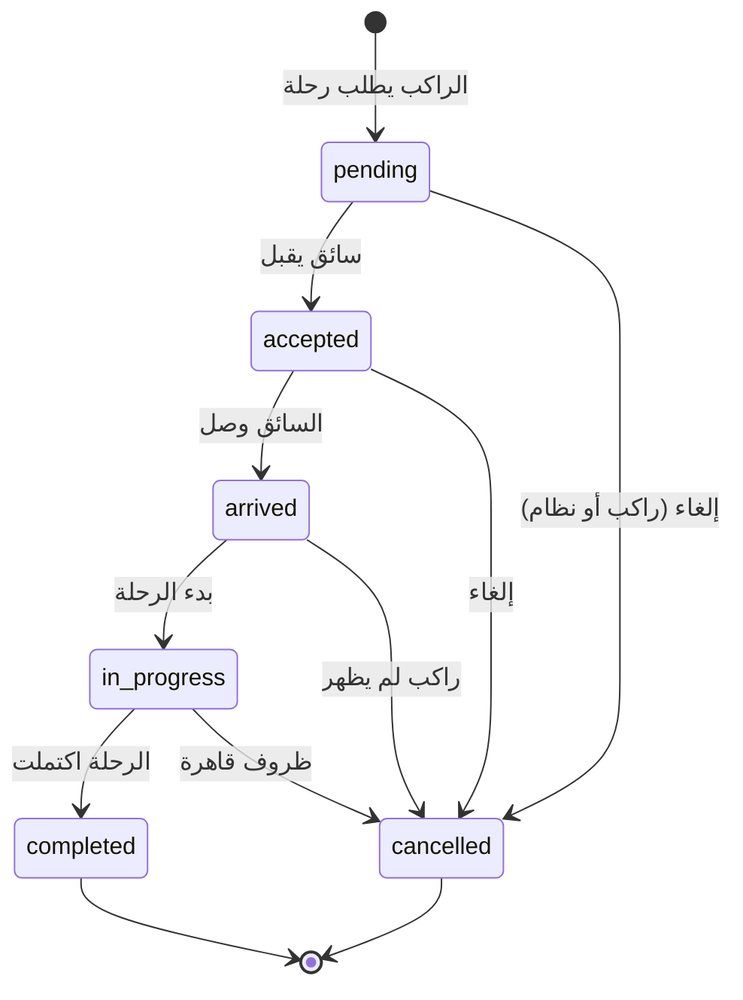

# AI_MASTER_REFERENCE.md

# ران RAAN - الوثيقة المرجعية الشاملة

**آخر تحديث:** 2026-02-22  
**الإصدار:** 1.2.1  
**المُنشئ:** نظام التطوير الذكي

---

> ⚠️ **تحذير للذكاء الاصطناعي:**  
> يجب قراءة هذا الملف **كاملاً** قبل أي تعديل على المشروع.  
> هذا الملف هو **المصدر الوحيد للحقيقة** في المشروع.

---

## 📋 جدول المحتويات

1. [هوية المشروع](#1-هوية-المشروع)
2. [هيكل المشروع](#2-هيكل-المشروع)
3. [هيكل قاعدة البيانات](#3-هيكل-قاعدة-البيانات)
4. [دورة حياة الرحلة](#4-دورة-حياة-الرحلة)
5. [قواعد التسعير](#5-قواعد-التسعير)
6. [قواعد الإرسال للسائقين](#6-قواعد-الإرسال-للسائقين)
7. [المستخدمون والصلاحيات](#7-المستخدمون-والصلاحيات)
8. [الميزات الحالية](#8-الميزات-الحالية)
9. [الميزات المخططة](#9-الميزات-المخططة)
10. [أفكار مرفوضة](#10-أفكار-مرفوضة)
11. [قواعد التطوير](#11-قواعد-التطوير)
12. [سجل التغييرات](#12-سجل-التغييرات)
13. [مهام المستقبل](#13-مهام-المستقبل)

---

## 1. هوية المشروع

### الاسم

**ران RAAN** - تطبيق تاكسي عراقي ذكي

### الرؤية

أن نكون التطبيق الأول والأكثر موثوقية للتنقل في العراق.

### الأهداف الرئيسية

- ✅ توفير خدمة توصيل آمنة وموثوقة
- ✅ دعم السائقين العراقيين وتوفير دخل مستدام
- ✅ تقديم أسعار عادلة وشفافة
- ✅ بناء مجتمع نقل موثوق

### ما ليس من أهدافنا (Non-Goals)

- ❌ لن نكون منصة توصيل طعام (حالياً)
- ❌ لن نقدم خدمات الشحن الكبيرة
- ❌ لن نتنافس على السعر فقط على حساب الجودة
- ❌ لن نسمح بسائقين غير موثقين

### السوق المستهدف

- 🇮🇶 العراق (بغداد أولاً، ثم باقي المحافظات)
- 👥 الفئة العمرية: 18-55 سنة
- 📱 مستخدمو الهواتف الذكية

---

## 2. هيكل المشروع

### التقنيات المستخدمة

| الطبقة | التقنية |
|--------|---------|
| **Frontend** | React 18 + TypeScript + Vite |
| **Styling** | Tailwind CSS + shadcn/ui |
| **State** | React Query + useState |
| **Backend** | Supabase (PostgreSQL + Auth + Realtime) |
| **Maps** | Mapbox GL JS |
| **Animations** | Framer Motion |

### هيكل المجلدات

```
src/
├── components/
│   ├── admin/          # مكونات لوحة الأدمن
│   ├── rider/          # مكونات شاشات الراكب
│   ├── driver/         # مكونات شاشات السائق
│   ├── ui/             # مكونات shadcn/ui
│   └── common/         # مكونات مشتركة
├── pages/
│   ├── admin/          # صفحات الأدمن (24 صفحة)
│   ├── rider/          # صفحات الراكب (7 صفحات)
│   └── driver/         # صفحات السائق (12 صفحة)
├── hooks/              # Custom React Hooks
├── lib/                # Utilities والثوابت
├── integrations/       # Supabase client
└── assets/             # الصور والأيقونات

supabase/
├── migrations/         # ملفات ترحيل قاعدة البيانات (75 ملف)
├── functions/          # Edge Functions
└── *.sql               # ملفات SQL للإصلاح السريع
```

---

## 3. هيكل قاعدة البيانات

### الجداول الأساسية

#### 3.1 profiles (الملفات الشخصية)

```sql
profiles (
  id UUID PRIMARY KEY,
  user_id UUID UNIQUE → auth.users,
  full_name TEXT,
  phone TEXT,
  avatar_url TEXT,
  preferred_language TEXT DEFAULT 'ar',
  created_at, updated_at
)
```

**القيود:** يجب أن يكون الاسم حقيقياً (كلمتين+)، لا أسماء محظورة.

#### 3.2 user_roles (الأدوار)

```sql
user_roles (
  id UUID PRIMARY KEY,
  user_id UUID → auth.users,
  role app_role ENUM('admin', 'moderator', 'user'),
  UNIQUE(user_id, role)
)
```

#### 3.3 drivers (السائقون)

```sql
drivers (
  id UUID PRIMARY KEY,
  user_id UUID UNIQUE → auth.users,
  full_name TEXT NOT NULL,
  phone TEXT NOT NULL,
  license_number, license_image_url, id_image_url,
  vehicle_type ENUM('economy','comfort','premium','women_only'),
  vehicle_model, vehicle_color, vehicle_plate,
  status ENUM('pending','approved','rejected','suspended'),
  is_online BOOLEAN, is_available BOOLEAN,
  current_location JSONB,
  total_earnings, total_rides, rating
)
```

**قاعدة مهمة:** السائق لا يمكنه قبول رحلات إلا إذا: `status='approved' AND is_online=true AND is_available=true`

#### 3.4 rides (الرحلات)

```sql
rides (
  id UUID PRIMARY KEY,
  rider_id UUID → auth.users,
  driver_id UUID → drivers,
  region_id UUID → regions,
  pickup_location JSONB NOT NULL {lat, lng},
  pickup_address TEXT,
  dropoff_location JSONB NOT NULL {lat, lng},
  dropoff_address TEXT,
  vehicle_type, status, 
  estimated_fare INTEGER,
  final_fare INTEGER,
  distance_km, duration_minutes, waiting_minutes,
  payment_method ENUM('cash','zain_cash','asia_hawala','qi_card'),
  rider_rating, driver_rating,
  cancelled_by, cancellation_reason,
  started_at, completed_at
)
```

#### 3.5 regions (المناطق)

```sql
regions (
  id UUID PRIMARY KEY,
  name_ar TEXT NOT NULL,
  name_en, name_ku,
  base_fare INTEGER DEFAULT 2000,
  per_km_fare INTEGER DEFAULT 500,
  waiting_fare_per_min INTEGER DEFAULT 100,
  is_active BOOLEAN,
  coordinates JSONB
)
```

### جداول إضافية

| الجدول | الوظيفة |
|--------|---------|
| `landmarks` | النقاط الدالة (جامعات، مولات...) |
| `referral_codes` | أكواد الإحالة |
| `referrals` | سجل الإحالات |
| `ride_share_links` | روابط مشاركة الرحلة |
| `ride_reviews` | التقييمات المتقدمة |
| `review_tags` | وسوم التقييم |
| `banned_names` | الأسماء المحظورة |
| `ride_matching_log` | سجل مطابقة الرحلات |
| `push_tokens` | توكنات الإشعارات |

---

## 4. دورة حياة الرحلة

### مخطط الحالات



### قواعد الانتقال بين الحالات

| من | إلى | الشرط | المسؤول |
|----|-----|-------|---------|
| - | `pending` | طلب جديد | راكب |
| `pending` | `accepted` | سائق قريب متاح | سائق |
| `pending` | `cancelled` | إلغاء قبل 3 دقائق | راكب (بدون غرامة) |
| `pending` | `cancelled` | لا يوجد سائق متاح بعد 5 دقائق | نظام |
| `accepted` | `arrived` | السائق على بعد <100 متر | سائق |
| `accepted` | `cancelled` | إلغاء بعد القبول | غرامة على المُلغي |
| `arrived` | `in_progress` | الراكب ركب السيارة | سائق |
| `arrived` | `cancelled` | بعد 5 دقائق انتظار | سائق (غرامة على الراكب) |
| `in_progress` | `completed` | الوصول للوجهة | سائق |

### 🚨 قواعد لا يجب كسرها

> [!CAUTION]
>
> - **لا يمكن العودة من `completed` أو `cancelled`**
> - **الرحلة المُلغاة لا يمكن إعادة فتحها**
> - **`in_progress` لا يمكن الرجوع منها لـ `accepted`**

---

## 5. قواعد التسعير

### صيغة حساب الأجرة

```typescript
الأجرة = الأجرة_الأساسية 
       + (المسافة_كم × سعر_الكيلومتر) 
       + (دقائق_الانتظار × سعر_دقيقة_الانتظار)
       × معامل_نوع_السيارة
       × معامل_الذروة
```

### معاملات أنواع السيارات

| النوع | المعامل | الوصف |
|-------|---------|-------|
| `economy` | 1.0 | اقتصادي |
| `comfort` | 1.3 | مريح |
| `premium` | 1.8 | فاخر |
| `women_only` | 1.2 | نسائي |

### تسعير الذروة (Surge Pricing)

| الحالة | المعامل |
|--------|---------|
| طلب عادي | 1.0 |
| طلب مرتفع (>5 دقائق انتظار) | 1.2 |
| ذروة شديدة (مناسبات/أعياد) | 1.3-1.5 |
| حد أقصى | 2.0 |

### 🚨 قواعد لا يجب كسرها

> [!CAUTION]
>
> - **الحد الأدنى للأجرة = الأجرة الأساسية**
> - **لا يمكن تقليل السعر بعد بدء الرحلة**
> - **العمولة 15% ثابتة (قابلة للتعديل بواسطة الأدمن فقط)**

---

## 6. قواعد الإرسال للسائقين

### خوارزمية اختيار السائق

```
1. فلترة السائقين:
   - status = 'approved'
   - is_online = true
   - is_available = true
   - vehicle_type = المطلوب

2. ترتيب حسب:
   - المسافة من نقطة الالتقاء (الأقرب أولاً)
   - التقييم (الأعلى أولاً)
   - عدد الرحلات اليوم (الأقل أولاً للتوزيع العادل)

3. إرسال الطلب:
   - للسائق الأول: 20 ثانية مهلة
   - إذا لم يرد: للسائق التالي
   - حد أقصى 5 سائقين
   - بعد 5 محاولات: إلغاء تلقائي
```

### نطاق البحث

| المحاولة | النطاق |
|----------|--------|
| 1 | 2 كم |
| 2 | 3 كم |
| 3 | 5 كم |
| 4+ | 8 كم |

---

## 7. المستخدمون والصلاحيات

### أنواع المستخدمين

| النوع | الصلاحيات |
|-------|----------|
| **مستخدم عادي (user)** | حجز رحلات، عرض السجل، تقييم |
| **سائق (driver)** | قبول رحلات، تتبع الأرباح، إدارة الحساب |
| **مشرف (moderator)** | عرض التقارير، حل النزاعات |
| **مدير (admin)** | كل الصلاحيات، إدارة النظام |

### Row Level Security (RLS)

جميع الجداول محمية بـ RLS:

- المستخدم يرى بياناته فقط
- السائق يرى رحلاته فقط
- الأدمن يرى الكل

---

## 8. الميزات الحالية

### ✅ مُنجزة

| الميزة | الحالة | التاريخ |
|--------|--------|---------|
| تسجيل دخول بالهاتف (OTP) | ✅ | 2025-12 |
| حجز رحلة من الخريطة | ✅ | 2025-12 |
| تتبع السائق على الخريطة | ✅ | 2025-12 |
| لوحة تحكم الأدمن | ✅ | 2025-12 |
| إدارة السائقين والموافقة | ✅ | 2025-12 |
| نظام التسعير المتقدم | ✅ | 2025-12 |
| نظام الإحالات | ✅ | 2025-12-26 |
| روابط مشاركة الرحلة | ✅ | 2025-12-26 |
| نظام التقييم المتقدم | ✅ | 2025-12-26 |
| إجبار الاسم الحقيقي | ✅ | 2025-12-27 |
| إدارة الأسماء المحظورة | ✅ | 2025-12-27 |
| **الدردشة راكب ↔ سائق** | ✅ | 2025-12-27 |

---

## 9. الميزات المخططة

### 🔜 المرحلة القادمة (Q1 2025)

| الميزة | الأولوية | التعقيد |
|--------|---------|---------|
| الرحلات المجدولة | عالية | متوسط |
| محفظة إلكترونية | عالية | عالي |
| نظام حوافز السائقين | متوسطة | متوسط |
| خريطة حرارية للطلب | متوسطة | متوسط |
| إشعارات Push | عالية | متوسط |

### 🗓️ المستقبل البعيد

| الميزة | الأولوية |
|--------|---------|
| تطبيق iOS/Android أصلي | عالية |
| دعم مدن أخرى | عالية |
| خدمة التوصيل (Delivery) | منخفضة |
| اشتراكات شهرية للراكبين | منخفضة |

---

## 10. أفكار مرفوضة

> [!WARNING]
> هذه الأفكار تم رفضها ولا يجب تنفيذها:

| الفكرة | سبب الرفض |
|--------|-----------|
| إزالة التقييم من السائقين | يُضعف الجودة |
| السماح بأسماء مستعارة | يُقلل الثقة والأمان |
| إلغاء الحد الأدنى للأجرة | غير عادل للسائقين |
| السماح بالدفع اللاحق | مخاطر حسابية |
| إزالة OTP | مخاطر أمنية |
| سائقين بدون وثائق | غير قانوني |

---

## 11. قواعد التطوير

### ✅ يجب فعله

- [ ] قراءة هذا الملف قبل أي تعديل
- [ ] التحقق من دورة حياة الرحلة
- [ ] احترام قواعد التسعير
- [ ] استخدام TypeScript بصرامة
- [ ] إضافة RLS لأي جدول جديد
- [ ] كتابة تعليقات عربية للكود

### ❌ لا يجب فعله

- [ ] تعديل حالات الرحلة بدون فهم
- [ ] تغيير صيغة التسعير بدون موافقة
- [ ] إضافة جداول بدون RLS
- [ ] حذف بيانات بدون نسخ احتياطي
- [ ] تعديل `auth.users` مباشرة

### 📝 تنسيق الكود

```typescript
// التعليقات بالعربية
// استخدم camelCase للمتغيرات
// استخدم PascalCase للمكونات
// كل function يجب أن يكون لها نوع محدد
```

---

## 🐛 الأخطاء الشائعة وكيفية تجنبها

### أخطاء React الشائعة

| الخطأ | السبب | الحل |
|-------|-------|------|
| `useState(true)` في البداية | يعرض المكون فوراً | استخدم `useState(false)` ثم فعّل بشرط |
| `navigate()` في useEffect بدون شروط | حلقة لانهائية | أضف شرط قبل navigate |
| `setTimeout` لانتظار state | الحالة قد لا تتحدث | استخدم useEffect مع dependency |
| عدم معالجة جميع أكواد GPS | رسائل خطأ غير مفهومة | استخدم switch/case شامل |

### أخطاء Supabase الشائعة

| الخطأ | السبب | الحل |
|-------|-------|------|
| Realtime لا يعمل | RLS يمنع الوصول | تحقق من سياسات RLS |
| INSERT يفشل | missing required fields | تحقق من NOT NULL columns |
| UPDATE يرجع 0 rows | RLS أو id خاطئ | تحقق من الصلاحيات والـ id |

### أفضل الممارسات

1. **دائماً** أضف validations قبل العمليات الحساسة (حجز، دفع، إلغاء)
2. **دائماً** استخدم try/catch مع toast للأخطاء
3. **دائماً** اختبر على أجهزة مختلفة قبل الدمج
4. **تجنب** console.log في الإنتاج (استخدم console.debug)
5. **تجنب** تخزين بيانات حساسة في localStorage

---

## 12. سجل التغييرات

### 2026-02-22 (v1.2.1) — Reverse Geocoding

| النوع | التغيير | السبب |
|-------|---------|-------|
| **تحسين** | **Reverse Geocoding محسّن في بوت واتساب + تيليغرام** | **تحويل الإحداثيات لعنوان مختصر (حي + مدينة) بدل الإحداثيات الخام** |
| **تحسين** | **استخراج عنوان مختصر من `address_components`** | **عرض "حي التأميم، الرمادي" بدل العنوان الكامل الطويل** |
| **تحسين** | **Nominatim/OpenStreetMap كاحتياط مجاني** | **ضمان عمل العناوين حتى بدون مفتاح Google API** |
| **تحسين** | **تحديث رسالة تأكيد الموقع: `📍 حددنا مكانك في:`** | **UX أفضل للمستخدم بدل عرض إحداثيات خام** |

### 2026-02-22 (v1.2.0) — Live Driver Tracking

| النوع | التغيير | السبب |
|-------|---------|-------|
| **ميزة** | **نظام تتبع السائق المباشر (Live Tracking)** | **تتبع موقع السائق لحظة بلحظة عبر رابط ويب عام** |
| **ميزة** | **جدول `driver_live_locations` + Supabase Realtime** | **بث موقع السائق كل 5 ثوانٍ أثناء الرحلة** |
| **ميزة** | **صفحة تتبع محسّنة `/track/:token`** | **خريطة مباشرة + حالة الرحلة + معلومات السائق** |
| **ميزة** | **Edge Function `generate-tracking-link`** | **توليد رابط تتبع تلقائي عند قبول الرحلة** |
| **ميزة** | **Edge Function `whatsapp-ride-updates`** | **إشعارات واتساب فورية عند تغيير حالة الرحلة** |
| **تحسين** | **إضافة رابط التتبع في إشعارات تيليغرام** | **الراكب يستلم رابط التتبع مع تأكيد قبول الكابتن** |
| **تحسين** | **إضافة رابط التتبع في إشعارات واتساب** | **نفس الميزة لمستخدمي واتساب** |
| **تحسين** | **Hook `useDriverLocationSync`** | **مزامنة موقع السائق مع DB + Realtime** |
| **تحسين** | **Trigger تنظيف تلقائي** | **حذف بيانات الموقع عند اكتمال/إلغاء الرحلة** |
| **تحسين** | **Trigger إشعارات واتساب** | **DB Webhook لرحلات الواتساب** |

### 2026-01-10

| النوع | التغيير | السبب |
|-------|---------|-------|
| **تحسين** | **ملخص الرحلة في لوحة الحجز** | **عرض المسافة/الوقت/السائقين قبل الحجز** |
| **تحسين** | **Dialog تأكيد الحجز** | **تأكيد قبل إرسال الطلب** |
| **إصلاح** | **حذف زر وصلت للوجهة من الراكب** | **هذه الوظيفة للسائق فقط** |
| **إصلاح** | **5 إصلاحات حرجة لصفحة الراكب** | **تحسين الاستقرار** |
| **تحسين** | **CMS تسجيل السائقين** | **إدارة محتوى صفحة التسجيل** |

### 2025-12-27

| النوع | التغيير | السبب |
|-------|---------|-------|
| ميزة | نظام الأسماء المحظورة | منع الأسماء الوهمية |
| ميزة | شاشة إكمال الملف الشخصي | إجبار الاسم الحقيقي |
| ميزة | صفحة إدارة الأسماء للأدمن | تحكم ديناميكي |
| **ميزة** | **الدردشة راكب ↔ سائق** | **تواصل سهل** |
| **ميزة** | **مساعد الأدمن الذكي (DeepSeek)** | **تحليل البيانات والدعم** |
| **تحسين** | **Error Boundary** | **منع انهيار التطبيق** |
| **تحسين** | **Skeleton Loading** | **تجربة تحميل أفضل** |
| **تحسين** | **Pull-to-Refresh** | **تحديث سهل** |
| **تحسين** | **Zustand Store (راكب + سائق)** | **إدارة حالة مركزية** |
| **تحسين** | **تقسيم ActiveRideCard** | **كود أنظف** |
| **تحسين** | **Driver Skeletons** | **تحميل أفضل للسائق** |

### 2025-12-26

| النوع | التغيير | السبب |
|-------|---------|-------|
| ميزة | نظام الإحالات | زيادة المستخدمين |
| ميزة | روابط مشاركة الرحلة | أمان الراكب |
| ميزة | نظام التقييم المتقدم | تحسين الجودة |
| تحسين | ربط السائق بالهاتف | حل مشاكل تسجيل الدخول |
| إصلاح | الملفات الشخصية المفقودة | ظهور جميع المستخدمين |

---

## 13. مهام المستقبل

### الأولوية القصوى 🔴

- [x] ~~نظام الدردشة في الرحلة~~ ✅
- [ ] إشعارات Push للتطبيق
- [ ] تحسين أداء الخريطة

### أولوية عالية 🟠

- [ ] نظام حوافز السائقين
- [x] ~~الرحلات المجدولة~~ ✅
- [ ] تقارير مالية متقدمة
- [x] ~~CMS لتسجيل السائقين~~ ✅

### أولوية متوسطة 🟡

- [ ] خريطة حرارية
- [ ] مناطق جديدة
- [ ] دعم اللغة الكردية
- [x] ~~Dialog تأكيد الحجز~~ ✅
- [x] ~~ملخص الرحلة~~ ✅

### أولوية منخفضة 🟢

- [ ] Dark/Light mode toggle
- [ ] تصدير البيانات PDF
- [x] ~~إحصائيات متقدمة للسائق~~ ✅

---

## 📌 ملاحظات للذكاء الاصطناعي

> [!IMPORTANT]
> **عند العمل على هذا المشروع:**
>
> 1. اقرأ هذا الملف كاملاً أولاً
> 2. تحقق من القسم المتعلق بالميزة
> 3. لا تُغيّر شيء مذكور في "أفكار مرفوضة"
> 4. احترم دورة حياة الرحلة
> 5. أضف أي تغيير جديد في سجل التغييرات
> 6. اسأل المستخدم إذا كان هناك غموض

---

**نهاية الوثيقة**  
*آخر تحديث: 2026-02-22 بتوقيت بغداد*
