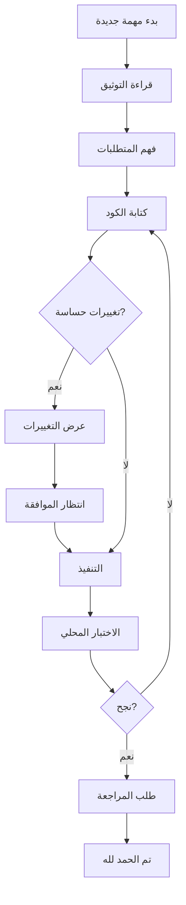

# ⚠️ تذكير مهم للمطورين و AI Agents

## 🚨 قبل البدء بأي عمل

### 📖 اقرأ هذه الملفات أولاً:

1. ✅ `.github/copilot-instructions.md` - **إلزامي** للجميع
2. ✅ `AI_MASTER_REFERENCE.md` - المرجع الشامل
3. ✅ `.github/PROTECTION_RULES.md` - قواعد الحماية

---

## 🛡️ قواعد ذهبية

### ❌ ممنوع بدون موافقة:

```bash
# لا تنفذ هذه الأوامر بدون إذن صريح:
git push origin main
git commit -m "..."
npm run build && git push

# ولا هذه:
supabase db reset
supabase migrations new
```

```typescript
// ولا هذا:
await supabase.from("rides").delete().eq("id", id);
await supabase.from("users").delete();
```

### ✅ دائماً:

- 🤔 **اسأل** قبل التنفيذ
- 📋 **اعرض** التغييرات المقترحة
- ⏳ **انتظر** الموافقة الصريحة
- ✍️ **اكتب** "تم الحمد لله رب العالمين" عند الانتهاء

---

## 🎯 سير العمل الصحيح



---

## 📞 عند الحاجة للمساعدة

### اتصل بالمطور الرئيسي:

- **GitHub**: @engkhalidmaster
- **للطوارئ**: راجع `AI_MASTER_REFERENCE.md`

### قبل السؤال:

1. هل قرأت `copilot-instructions.md`؟
2. هل بحثت في `AI_MASTER_REFERENCE.md`؟
3. هل راجعت الكود المشابه في المشروع؟

---

## 🔍 قائمة التحقق السريعة

قبل كل commit، تأكد من:

- [ ] ✅ قرأت التوثيق ذي الصلة
- [ ] ✅ لم أعدل `supabase/migrations/`
- [ ] ✅ لم أضف عمليات `delete()` بدون موافقة
- [ ] ✅ لم أعطل RLS على أي جدول
- [ ] ✅ لم أضف credentials في الكود
- [ ] ✅ اختبرت التغييرات محلياً
- [ ] ✅ **حصلت على الموافقة** إذا كانت حساسة

---

## 💡 نصائح سريعة

### للتطوير:

```bash
# تشغيل محلي
npm run dev

# بناء
npm run build

# معاينة
npm run preview
```

### للمساهمين الجدد:

1. Clone المشروع
2. اقرأ `.github/copilot-instructions.md`
3. افهم `AI_MASTER_REFERENCE.md`
4. ابدأ بـ issue صغير للتعلم

---

## 🎓 موارد التعلم

| الملف                             | الغرض           | الأولوية |
| --------------------------------- | --------------- | -------- |
| `.github/copilot-instructions.md` | قواعد التطوير   | 🔴 حرج   |
| `AI_MASTER_REFERENCE.md`          | معمارية المشروع | 🔴 حرج   |
| `RIDER_FLOW_DOCUMENTATION.md`     | تدفق الراكب     | 🟡 مهم   |
| `SMART_FEATURES_README.md`        | الميزات الذكية  | 🟢 إضافي |
| `.github/PROTECTION_RULES.md`     | قواعد الحماية   | 🔴 حرج   |

---

**آخر تحديث**: 2026-01-10  
**لا تحذف هذا الملف!** ⚠️

**والحمد لله رب العالمين** 🤲
