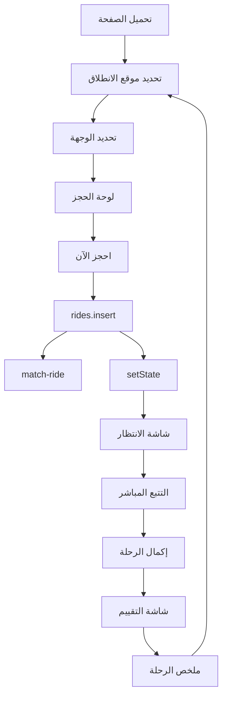

# فحص تدفق الراكب — `/rider/go` (من الدخول حتى إكمال الرحلة)

تاريخ الفحص: 2026-03-01  
الصفحة: `http://localhost:8080/rider/go` — المكون: [GoPage.tsx](src/pages/rider/GoPage.tsx)

---

## 1. نظرة عامة على التدفق

---

## 2. مراحل التدفق والبيانات والأزرار

### 2.1 تحميل الصفحة والدخول

| العنصر | المصدر | الوظيفة |
|--------|--------|----------|
| المستخدم والموقع | `useRiderData()` | `userId`, `user`, `userLocation`, `mapToken` |
| الخريطة الرئيسية | `useLocationPicker(mapToken, userLocation, mapReloadKey)` | `map`, `mapContainer`, `centerAddress`, `centerLat/Lng`, `checkServiceArea`, `reverseGeocode` |
| صلاحية الموقع | `LocationPermissionPrompt` | يظهر عند `showLocationPrompt`؛ عند الموافقة يُحدَّث الموقع |

**ملاحظة:** لا يُستخدم `riderStore` لـ pickup/dropoff في GoPage؛ الحالة محلية فقط: `pickupLocation`, `dropoffLocation`, `currentMode` داخل GoPage.

---

### 2.2 تحديد موقع الانطلاق (وضع pickup)

| الحالة | النوع | الاستخدام |
|--------|--------|------------|
| `currentMode` | `"pickup" \| "dropoff" \| "booking"` | يتحكم بالشاشة المعروضة (خريطة اختيار موقع vs لوحة حجز) |
| `pickupLocation` | `{ lat, lng, address } \| null` | موقع الانطلاق؛ يُعبَّأ عند التأكيد |
| `centerLat`, `centerLng`, `centerAddress` | من `useLocationPicker` | مركز الخريطة والعنوان الحالي (سحب أو بحث) |

**الأزرار والحقول:**

- **تأكيد موقع الانطلاق:** استدعاء `handleMapConfirm()` عند الضغط على "تأكيد موقع الانطلاق" — يتحقق من Geofencing (داخل العراق)، ثم `setPickupLocation(location)` و `setCurrentMode(dropoffLocation ? "booking" : "dropoff")`.
- **تحديد موقعي:** زر يحرك الخريطة لموقع المستخدم الحالي (من `useLocationPicker` أو `manualGeolocateMain`).
- **بحث:** حقل البحث يغذي `predictions` عبر `useSearchAndPlaces`؛ اختيار نتيجة يحدّث مركز الخريطة ثم المستخدم يؤكد.
- **الرجوع:** زر سهم — من وضع الوجهة يعيد `setCurrentMode("pickup")`.

**التحقق:** Geofencing عبر `checkDestinationGeofence`؛ إذا الوجهة خارج العراق يُعرض `GeofenceAlert` ولا يُحفظ الموقع.

---

### 2.3 تحديد الوجهة (وضع dropoff)

نفس آلية الانطلاق: سحب الخريطة أو بحث، ثم "تأكيد الوجهة". عند التأكيد: `setDropoffLocation(location)` و `setCurrentMode("booking")`. Geofencing يُطبَّق أيضاً على الوجهة.

---

### 2.4 لوحة الحجز (وضع booking)

تُعرض عندما `currentMode === "booking"` و `pickupLocation` و `dropoffLocation` معبّأة.

| البيانات المعروضة | المصدر |
|-------------------|--------|
| المسافة والوقت | `routeDistance`, `routeDuration` من `useBookingFlow` (يُحسبان عند تهيئة خريطة الحجز أو عند جلب المسار) |
| السعر | `useFareCalculation(pickupLocation, dropoffLocation, selectedVehicle, routeDistance)` → `fareBreakdown`, `fareLoading`, `fareError` |
| نوع المركبة | `selectedVehicle`, `setSelectedVehicle` من `useBookingFlow` (economy / comfort / premium / women_only) |
| طريقة الدفع | `paymentMethod`, `setPaymentMethod` من `useBookingFlow`؛ يفتح `PaymentMethodSheet` |

**الأزرار:**

- **احجز الآن:** يستدعي `handleBookRide()` (انظر القسم 3).
- **تغيير (موقع الانطلاق / الوجهة):** `startLocationEdit("pickup")` أو `startLocationEdit("dropoff")` — يعيد فتح الخريطة في الوضع المناسب.
- **عكس الاتجاه:** يبدّل `pickupLocation` و `dropoffLocation`.
- **جدولة الرحلة:** يفتح `ScheduleRideDialog`؛ عند الجدولة يستدعي `resetBooking()`.

**خريطة الحجز:** `ref={bookingMapContainer}` و `initializeBookingMap(pickupLocation, dropoffLocation)` تُنفَّذان في `useEffect` عندما `currentMode === "booking"`؛ ثم يُستدعى `fetchRoute` لرسم المسار وتحديث `routeDistance` و `routeDuration`.

---

### 2.5 إنشاء الحجز — `handleBookRide()`

التسلسل المختصر:

1. **تعارض رحلة نشطة:** إن وُجدت `activeRide` غير مكتملة/ملغاة → toast + `setShowWaitingScreen(true)` ثم خروج.
2. **التحقق من pickup/dropoff:** إن ناقص → toast "معلومات ناقصة".
3. **منطقة الخدمة:** `checkServiceArea` لموقع الانطلاق والوجهة؛ إن خارج الخدمة → toast وعدم المتابعة.
4. **حساب السعر:** إن `fareBreakdown?.total_fare <= 0` → toast "خطأ في حساب السعر".
5. **الدفع بالمحفظة:** إن `paymentMethod === "wallet"` يتحقق من `profiles.wallet_balance`؛ إن غير كافٍ → toast وفتح ورقة الدفع.
6. **حفظ آخر رحلة:** `saveLastRide(...)` للتجديد السريع لاحقاً.
7. **حدود الرحلات:** قراءة `app_settings.security_settings` (max_active_rides_per_user، ride_creation_cooldown_seconds) والتحقق من عدد الرحلات النشطة ووقت التبريد.
8. **الإدراج في DB:**  
   `supabase.from("rides").insert([{ rider_id, pickup_location, dropoff_location, pickup_address, dropoff_address, vehicle_type, payment_method, estimated_fare, distance_km, duration_minutes, status: "pending" }]).select().single()`
9. **تحديث الواجهة:** `setActiveRide(ride)`, `setShowWaitingScreen(true)`.
10. **مطابقة السائق:** `supabase.functions.invoke("match-ride", { body: { rideId: ride.id } })` في الخلفية (مع timeout 8 ثوانٍ).

**الحقول المرسلة إلى `rides`:**  
`rider_id`, `pickup_location` (كائن), `dropoff_location` (كائن), `pickup_address`, `dropoff_address`, `vehicle_type`, `payment_method` (من `mapPaymentToDb`), `estimated_fare` (من `roundFare(fareBreakdown.total_fare)`), `distance_km`, `duration_minutes`, `status: "pending"`, `trip_type: "app"`.  
**تطبيق:** تم تمرير `trip_type: "app"` صراحة في الإدراج.

---

### 2.6 شاشة الانتظار

تُعرض عندما `showWaitingScreen && activeRide`. المكون: `RideWaitingScreen` مع `rideId`, عناوين الانطلاق والوجهة، الأجرة، `onCancel={resetBooking}`, `onDriverFound` الذي ينادي `setShowWaitingScreen(false)` و `setShowLiveTracker(true)`.

مصدر التحديثات: Realtime على `rides` + أي polling/fallback داخل `useActiveRide` / المكون.

---

### 2.7 التتبع المباشر وإكمال الرحلة

عندما `showLiveTracker && activeRide`: يُعرض `LiveRideTracker`. عند تحديث الرحلة إلى `completed` أو `cancelled` يُستدعى `onRideUpdate` الذي ينادي `resetBooking()`.

بعد الإكمال: من `useActiveRide` تُعرض شاشة التقييم ثم الملخص:

- **التقييم:** `showCompletedScreen && completedRide && !showRatingScreen` → `RideRatingScreen`؛ عند الإغلاق `setShowRatingScreen(true)`.
- **الملخص:** `showRatingScreen && showCompletedScreen && completedRide` → `RideCompletedScreen`؛ عند الإغلاق: `handleRideCompletion()`, `resetBooking()`.

---

## 3. ربط الحالة (البيانات) بين المكونات

| الحالة | أين تُخزَن | من يقرأها |
|--------|------------|-----------|
| موقع الانطلاق/الوجهة | GoPage: `pickupLocation`, `dropoffLocation` | useBookingFlow (خريطة الحجز، المسار)، useFareCalculation، useOptimizedNearbyDrivers، handleBookRide |
| وضع الشاشة | GoPage: `currentMode` | العرض الشرطي (خريطة اختيار vs لوحة حجز) |
| الرحلة النشطة وشاشات التتبع | useActiveRide (عبر useRideTracking): `activeRide`, `showWaitingScreen`, `showLiveTracker`, `completedRide`, `showCompletedScreen`, `showRatingScreen` | GoPage يعرض RideWaitingScreen / LiveRideTracker / RideRatingScreen / RideCompletedScreen |
| نوع المركبة والدفع | useBookingFlow: `selectedVehicle`, `paymentMethod` | لوحة الحجز، handleBookRide |
| المسافة والوقت | useBookingFlow: `routeDistance`, `routeDuration` | لوحة الحجز، handleBookRide (distance_km, duration_minutes) |
| السعر | useFareCalculation: `fareBreakdown` | لوحة الحجز، زر "احجز الآن"، handleBookRide (estimated_fare) |

**riderStore:** يُستخدم في GoPage لـ `setUserLocation` (من handleGeolocate) و `bottomNavEnabled` فقط؛ لا يُستخدم لـ pickup/dropoff أو الحجز.

---

## 4. ملاحظات وتحسينات مقترحة لتحقيق أفضل حجز

### 4.1 تعارض محتمل مع التتبع (ignorePolling) — تم تطبيقه

في `handleBookRide` يتم استدعاء `setActiveRide` و `setShowWaitingScreen` بعد الإدراج مباشرة؛ استعلام useActiveRide الدوري قد يمسح الحالة لو نُفّذ قبل ظهور الصف. **تم:** استدعاء `setIgnorePolling(true)` قبل الإدراج و`setIgnorePolling(false)` بعد نجاح الإدراج أو في بداية الـ catch.

### 4.2 إزالة console في مسار الحجز — جزئي

تم استبدال الـ console في تأثير حساب السعر و resetBooking ورسالة فشل الحجز بـ `logger` و `showErrorToast`. ما زال هناك استدعاءات console في أماكن أخرى (مثل handleMapConfirm، geocoding) ويمكن توحيدها لاحقاً.

### 4.3 توحيد عرض الأخطاء — تم في فشل الحجز

تم استخدام `showErrorToast` عند فشل الإدراج في handleBookRide. يمكن توسيعه لبقية المسارات (مثل handleMapConfirm).

### 4.4 trip_type للحجوزات من التطبيق — تم

تم إضافة `trip_type: "app"` في `rides.insert` في handleBookRide.

### 4.5 زر "احجز الآن" مكرر

الزر يظهر في موضعين حسب `bottomNavEnabled`: داخل منطقة التمرير أو ثابتاً أسفل الشاشة. المنطق واحد؛ التأكد من أن الحالة `isBooking` تمنع الضغط المزدوج في كلا الموضعين (وهذا متحقق عبر `disabled={... || isBooking}`).

---

## 5. خلاصة التدفق من البداية للنهاية

1. **الدخول:** تحميل GoPage → useRiderData + useLocationPicker → خريطة مع شريط تقدم (انطلاق / وجهة).
2. **الانطلاق:** المستخدم يحدد المركز (سحب أو بحث) ثم يؤكد → Geofencing → `setPickupLocation` → الانتقال لوضع الوجهة.
3. **الوجهة:** نفس الآلية → `setDropoffLocation` → الانتقال لوضع الحجز.
4. **الحجز:** تهيئة خريطة الحجز + جلب المسار → عرض المسافة والوقت والسعر ونوع المركبة وطريقة الدفع → المستخدم يضغط "احجز الآن".
5. **التحقق والحجز:** تحقق تعارض، مناطق خدمة، سعر، محفظة، حدود رحلات → insert في `rides` → setActiveRide + setShowWaitingScreen → استدعاء match-ride.
6. **الانتظار:** RideWaitingScreen حتى قبول السائق → setShowLiveTracker(true).
7. **التتبع:** LiveRideTracker حتى اكتمال أو إلغاء الرحلة.
8. **بعد الإكمال:** RideRatingScreen ثم RideCompletedScreen → handleRideCompletion + resetBooking → العودة لخريطة الانطلاق.

جميع الارتباطات بين البيانات والأزرار والحقول الموضحة أعلاه تؤدي إلى هذا المسار؛ تطبيق التوصيات في القسم 4 يزيد استقرار الحجز ووضوح السلوك للمستخدم.
