# تقرير فحص نظام ران (تاكسي عراقي سمارت)

تاريخ التقرير: 2026-03-01

---

## الجزء الأول: قائمة العيوب الموحدة (مع أولوية ومراجع)

### عيوب حرجة (Critical)

| # | الوصف | الملف | السطور/المرجع | التوصية |
|---|--------|-------|----------------|----------|
| C1 | تخزين قيم حساسة داخل migration (anon JWT / بدائل مضمّنة). | `supabase/migrations/20260301000000_production_fixes_sms.sql` و`20260802000000_remove_secrets_whatsapp_sms_ride_triggers.sql` | — | **مُعالَج في المستودع:** إزالة المفاتيح المضمّنة؛ الاعتماد على `system_configs` فقط. راجع [SECURITY_OPS.md](SECURITY_OPS.md). |

### عيوب متوسطة (Medium)

| # | الوصف | الملف | السطور/المرجع | التوصية |
|---|--------|-------|----------------|----------|
| M1 | تسجيل كثيف في الكونسول في مسارات الإنتاج — يؤثر على الأداء وقد يكشف معلومات داخلية. | `src/hooks/useBookingFlow.ts` | 44, 49, 56, 64, 66, 77, 79, 82, 94, 105, 123, 131, 140, 183, 201, 219 | استبدال بدالة تحقق من `import.meta.env.DEV` أو إرسال إلى نظام مراقبة. |
| M2 | تسجيل كثيف في الكونسول في مسارات التتبع والحجز. | `src/hooks/useActiveRide.ts` | 71, 87, 91, 148, 156, 227, 231, 260, 264, 299, 318, 331, 353 | نفس آلية M1. |
| M3 | تعارض محتمل بين الحجز والتتبع: أي خطأ في ترتيب استدعاءات `setIgnorePolling` قد يمنع تحديث واجهة الراكب. | `src/hooks/useActiveRide.ts`، `src/hooks/useRideTracking.ts` | useActiveRide: 41–43, 226, 259, 410؛ useRideTracking: 24, 73 | توثيق واضح لترتيب الاستدعاءات؛ إضافة تعليق في الكود يشرح متى يُفعّل/يُلغى ignorePolling. |
| M4 | التحقق من توقيع Webhook واتساب يعتمد على fallback إلى `Deno.env` عند فشل تحميل الإعدادات من DB — في الإنتاج يجب ضمان تفعيل التحقق دائماً. | `supabase/functions/whatsapp-webhook/index.ts` | منطق التحقق من التوقيع (بعد سطر 132) | التأكد من أن WHATSAPP_APP_SECRET مضبوط في الإنتاج (DB أو env)؛ تفادي تشغيل الـ webhook بدون تفعيل التحقق. |

### عيوب منخفضة (Low)

| # | الوصف | الملف | السطور/المرجع | التوصية |
|---|--------|-------|----------------|----------|
| L1 | حقل `trip_type` يظهر بمعنيين: في جدول `rides` = منصة (app/whatsapp/telegram/…)؛ في جدول `scheduled_rides` = نوع الرحلة (one_way/round_trip). قد يسبب التباساً للمطورين. | أنظر توثيق trip_type أدناه | — | توثيق الفرق في الكود والـ DB؛ عدم خلط القيم بين الجدولين. |
| L2 | تعقيد Triggers على جدول `rides` (إلغاء، تعويض، إشعارات واتساب/تيليغرام/SMS، إلخ) — تغيير ترتيب أو شرط قد يؤثر على الإشعارات أو المحادثة المرحّلة. | `supabase/migrations/` (عدة ملفات) | 20260222100000, 20260301000000, 20260219000000, 20260223100000, 20260130000000, 20251219225610, … | توثيق تبعيات وترتيب تنفيذ الـ triggers في مستند واحد (انظر القسم 7). |

---

## الجزء الثاني: التحسينات (مرتبطة بالعيوب)

| العيب | نوع التحسين | الإجراء المقترح |
|-------|-------------|------------------|
| C1 | أمني | إزالة الأسرار من الـ migrations؛ استخدام placeholders أو سكربت إدراج منفصل لا يُرفع بقيم حقيقية. |
| M1, M2 | أداء/وضوح | إنشاء دالة `devLog(...)` تستدعى فقط عندما `import.meta.env.DEV === true`؛ استبدال كل استدعاءات console.log/warn في المسارات الحرجة بها أو بإرسال إلى نظام مراقبة. |
| M3 | وضوح كود | إضافة تعليق في `useActiveRide.ts` و `useRideTracking.ts` يوضح: "يُفعّل ignorePolling عند بدء حجز من التطبيق؛ يُلغى عند ظهور الرحلة أو إلغاء الحجز." وربط ذلك في توثيق تدفق الحجز. |
| M4 | أمني | في بيئة الإنتاج: التحقق من وجود WHATSAPP_APP_SECRET عند التشغيل؛ رفض معالجة الطلبات إذا كان التحقق من التوقيع معطلاً. |
| L1 | توثيق | توثيق قرار `trip_type` (انظر الجزء الرابع). |
| L2 | توثيق | إنشاء مستند (أو قسم في هذا التقرير) يوضح قائمة triggers على `rides` وترتيب تنفيذها والتبعيات. |
| — | تجربة مستخدم | توحيد معالجة الأخطاء في الواجهة: نفس نمط toast + رسالة واضحة في useBookingFlow، GoPage، useActiveRide. |
| — | تجربة مستخدم | توحيد رسائل Error Boundary حسب الفئة (شبكة، خريطة، حجز) لعرض رسائل أوضح للمستخدم. |

---

## الجزء الثالث: مخطط واحد قابل للطباعة — التطبيق ↔ الحجز ↔ واتساب ↔ البوت ↔ DB و Triggers

```mermaid
flowchart TB
  subgraph RiderApp["تطبيق الراكب"]
    GoPage[GoPage]
    useBF[useBookingFlow]
    useAR[useActiveRide]
    Wait[RideWaitingScreen]
    Live[LiveRideTracker]
    Done[RideCompletedScreen]
  end

  subgraph Booking["الحجز"]
    Insert[rides.insert]
    Match[match-ride Edge]
  end

  subgraph WhatsApp["واتساب"]
    WAUser[مستخدم واتساب]
    WH[whatsapp-webhook]
    AI[ai-services / local-classifier]
    Session[user-session]
    WARide[whatsapp-ride-updates]
    Relay[relay-chat-message]
  end

  subgraph Bot["البوت الذكي"]
    BotCust[bot_customers]
    Cache[cache]
  end

  subgraph DB["قاعدة البيانات و Triggers"]
    Rides[(rides)]
    Msgs[(ride_messages)]
    T1[trigger: notify_whatsapp_ride_status_change]
    T2[trigger: relay_ride_message_trigger]
  end

  GoPage --> useBF
  useBF --> Insert
  GoPage --> Insert
  Insert --> Rides
  Insert --> Match
  Match --> Rides
  Rides --> useAR
  useAR --> Wait
  useAR --> Live
  useAR --> Done

  WAUser --> WH
  WH --> BotCust
  WH --> AI
  WH --> Session
  Session --> Rides
  WH --> Rides

  Rides --> T1
  T1 --> WARide
  WARide --> WAUser

  Rides --> Msgs
  Msgs --> T2
  T2 --> Relay
  Relay --> WAUser

  AI --> Cache
```

**شرح مختصر:**

- **تطبيق الراكب:** GoPage + useBookingFlow يدرجان رحلة في `rides` ويستدعيان `match-ride`؛ useActiveRide يتابع الحالة ويعرض شاشات الانتظار/التتبع/الإكمال.
- **واتساب:** المستخدم يرسل رسائل إلى whatsapp-webhook؛ البوت يسجل في bot_customers ويستخدم ai-services/cache وجلسات user-session ويكتب في `rides`.
- **إشعارات الرحلة:** عند تغيّر `rides.status` يُنفّذ trigger `notify_whatsapp_ride_status_change` فيستدعي whatsapp-ride-updates لإرسال الرسائل لواتساب.
- **المحادثة:** عند إدراج رسالة في `ride_messages` يُنفّذ trigger `relay_ride_message_trigger` فيستدعي relay-chat-message لترحيل رسالة السائق إلى واتساب.

---

## الجزء الرابع: توثيق قرار `trip_type`

### 1. جدول `rides` (رحلة فعلية)

| القيمة | المعنى | أين تُستخدم |
|--------|--------|-------------|
| `app` | الرحلة من تطبيق الويب/الجوال | افتراضي عند الحجز من التطبيق إذا لم يُمرّر مصدر آخر. |
| `whatsapp` | الرحلة من بوت واتساب | whatsapp-webhook (user-session.ts)، whatsapp-ride-updates، relay-chat (RideChat يمرّر platform من ride.trip_type). |
| `telegram` | الرحلة من بوت تيليغرام | telegram-ai-booking، telegram-ride-updates، relay-chat. |
| `sms` | الرحلة من حجز SMS | sms-webhook، sms-booking، sms-ride-updates (trigger في 20260301000000). |
| `voice` | حجز صوتي (مثلاً واجهة صوتية) | يمكن استخدامه في voice-booking-ai أو مشابه. |
| `admin` | رحلة أنشأها المشرف | إداري. |

**القيود في DB:**  
`rides.trip_type` يخضع لـ CHECK: `trip_type IS NULL OR trip_type IN ('app', 'whatsapp', 'telegram', 'sms', 'voice', 'admin')`  
(انظر: `supabase/migrations/20260301000000_production_fixes_sms.sql` سطور 55–57.)

**الملفات الرئيسية:**

- `supabase/functions/whatsapp-webhook/index.ts` (إدراج رحلة مع trip_type: "whatsapp")
- `supabase/functions/whatsapp-webhook/lib/user-session.ts` (استعلامات بـ trip_type = 'whatsapp')
- `supabase/functions/whatsapp-ride-updates/index.ts` (يرسل إشعارات فقط عندما trip_type = 'whatsapp')
- `supabase/functions/telegram-ai-booking/index.ts`، `telegram-ride-updates/index.ts` (نفس الفكرة لـ telegram)
- `supabase/functions/sms-webhook/index.ts`، `supabase/functions/sms-booking/index.ts` (trip_type: 'sms')
- `supabase/migrations/20260223100000_ride_chat_relay_system.sql` (الـ trigger يمرّر platform من ride.trip_type إلى relay؛ شرط trip_type IN ('whatsapp', 'telegram'))
- `src/components/ride/RideChat.tsx` (يقرأ rider_id و trip_type من الرحلة ويمرّر trip_type كـ platform للـ relay)

### 2. جدول `scheduled_rides` (حجز مجدول)

| القيمة | المعنى | أين تُستخدم |
|--------|--------|-------------|
| `one_way` | ذهاب فقط | ScheduleRideDialog (إدراج في scheduled_rides)، DriverScheduledRidesBoard، ScheduledRideConfirmationDialog. |
| `round_trip` | ذهاب وعودة | نفس المكونات؛ عند round_trip يُدرج سجل ثانٍ للرحلة العائدة. |

**الملفات الرئيسية:**

- `src/components/rider/ScheduleRideDialog.tsx` (إدراج scheduled_rides مع trip_type: tripType = 'one_way' | 'round_trip')
- `src/components/driver/DriverScheduledRidesBoard.tsx` (عرض وتسمية one_way/round_trip)
- `src/components/driver/ScheduledRideConfirmationDialog.tsx` (عرض return_at عند round_trip)
- `supabase/migrations/20260201153000_advanced_scheduled_rides.sql` (إضافة عمود trip_type لـ scheduled_rides بقيمة افتراضية 'one_way')
- `supabase/functions/process-scheduled-rides/index.ts` (ينسخ trip_type من scheduled_rides عند إنشاء الرحلة)

### 3. خلاصة

- **لا يوجد خلط في نفس الجدول:** `rides.trip_type` = منصة فقط؛ `scheduled_rides.trip_type` = نوع الرحلة (ذهاب/ذهاب وعودة) فقط.
- **الالتباس المحتمل:** الاسم نفسه في جدولين لمعنيين مختلفين؛ يُنصح بالإبقاء على التوثيق أعلاه وربما إضافة تعليق في schema أو في types يوضح الفرق.

---

## الجزء الخامس: مراجعة الـ Migrations للقيم الحساسة وتوصية عدم تخزين الأسرار

### 1. نتائج المراجعة

| الملف | ما وُجد | السطور |
|-------|---------|--------|
| `supabase/migrations/20260301000000_production_fixes_sms.sql` | كان يحتوي قيماً حقيقية — **تم استبدالها ب placeholders (قيم فارغة)** في التطوير. | 92–95 |

لا توجد migrations أخرى في نطاق البحث تحتوي على إدراج واضح لمفاتيح أو أسرار حقيقية؛ `20260223200000_system_configs_table.sql` يدرج مفاتيح بأسماء مع قيم افتراضية فارغة أو وصفية.

### 2. التوصيات

1. **عدم تخزين أسرار حقيقية في ملفات migration:** أي migration يُدخل في `system_configs` (أو ما شابه) يجب ألا يحتوي على قيم فعلية لـ SUPABASE_URL أو SUPABASE_ANON_KEY أو أي توكن. يُفضّل:
   - إدراج قيم placeholder (مثل `''` أو `'REPLACE_ME'`) في الـ migration، أو
   - عدم إدراج هذه المفاتيح في الـ migration أصلاً، والاعتماد على إدخالها يدوياً من لوحة الإدارة أو سكربت تشغيل مرة واحدة خارج المستودع.

2. **مراجعة دورية:** عند إضافة migrations جديدة، التحقق من عدم وجود أي `INSERT` أو `UPDATE` لمفاتيح أو كلمات مرور أو توكنات حقيقية.

3. **المشروع الحالي:** تم استبدال القيم الحقيقية في الـ migration ب placeholders (قيم فارغة)؛ القيم الفعلية تُدرج من لوحة الإدارة.

---

## الجزء السادس: ترتيب Triggers على جدول `rides`

توثيق التبعيات وترتيب التنفيذ يساعد عند تعديل الـ triggers أو إضافة أخرى. في Postgres، الـ triggers من نفس النوع (مثلاً AFTER UPDATE) تُنفَّذ بترتيب أسمائها (عند عدم تحديد ترتيب صريح).

### Triggers على `rides` (ملخص)

| الاسم | الحدث | الملف | الوظيفة |
|------|--------|-------|----------|
| `validate_ride_status` | BEFORE UPDATE OF status | 20251215205625 | التحقق من صحة انتقال الحالة. |
| `update_rides_updated_at` | BEFORE UPDATE | 20251213074900 | تحديث عمود updated_at. |
| `on_new_ride_notify_drivers` | AFTER INSERT | 20260301000000 / 20251214044507 | إشعار السائقين برحلة جديدة (pg_net → match-ride أو إشعار). |
| `on_ride_status_change` | AFTER UPDATE | 20251214074519 | تحديث إحصائيات السائق عند تغيّر الحالة. |
| `on_ride_rating_update` | AFTER UPDATE | 20251214074519 | تحديث تقييم السائق عند التقييم. |
| `add_cancellation_compensation_trigger` | AFTER UPDATE | 20251219225610 | تعويض إلغاء. |
| `add_ride_earning_trigger` | AFTER UPDATE | 20251219225610 | تسجيل أرباح الرحلة. |
| `check_incentives_on_ride_complete` | AFTER UPDATE | 20251220150937 | فحص الحوافز عند إكمال الرحلة. |
| `complete_referral_trigger` | AFTER UPDATE | 20251226180000 | إكمال الإحالة عند إكمال الرحلة. |
| `trigger_rider_cancellation_penalty` | AFTER UPDATE | 20260215120000 | عقوبة إلغاء الراكب. |
| `trigger_handle_driver_cancellation` | AFTER UPDATE | 20260130000000 / 20260215120000 | معالجة إلغاء السائق (إعادة تعيين، إلخ). |
| `trg_cleanup_driver_live_location` | AFTER UPDATE OF status | 20260222100000 | تنظيف موقع السائق المباشر. |
| `whatsapp_ride_status_notify` | AFTER UPDATE | 20260301000000 / 20260222100000 | إشعار واتساب (trip_type=whatsapp) → whatsapp-ride-updates. |
| `telegram_ride_status_notify` | AFTER UPDATE | 20260219000000 | إشعار تيليغرام (trip_type=telegram). |
| `sms_ride_status_notify` | AFTER UPDATE | 20260301000000 | إشعار SMS (trip_type=sms) → sms-ride-updates. |
| `captain_risk_radar` | AFTER UPDATE | 20260610000000 | نظام كابتن جارديان (مخاطر). |
| `captain_compensation_shield` | AFTER UPDATE | 20260610000000 | نظام كابتن جارديان (تعويض). |

### ملاحظات

- **عدم تغيير الشروط دون مراجعة:** أي تغيير في شرط (مثلاً trip_type) داخل دالة trigger قد يوقف إشعارات واتساب/تيليغرام/SMS أو ترحيل المحادثة.
- **جدول ride_messages:** trigger `relay_ride_message_trigger` (في 20260223100000) يعمل على **ride_messages** وليس على rides؛ عند إدراج رسالة من السائق يستدعي relay-chat-message.
- **الترتيب الفعلي:** في نفس النوع (AFTER UPDATE) يعتمد على أسماء الـ triggers؛ عند إضافة trigger جديد يُفضّل اختيار اسم يوضح الغرض وتوثيق التبعية هنا.

---

## ملخص التقنيات والربط (للمرجع)

- **Frontend:** React 18، TypeScript، Vite، React Router v6، Zustand، TanStack Query، Supabase Client من `src/integrations/supabase/client.ts`.
- **Backend:** Supabase (Auth، Postgres، Realtime، Edge Functions). لا ORM؛ الوصول عبر Supabase JS و Edge Functions.
- **واتساب:** whatsapp-webhook (استقبال)، whatsapp-ride-updates (إشعارات الحالة)، relay-chat-message (ترحيل الدردشة)؛ الإعدادات من lib/config و system_configs.
- **البوت الذكي:** واتساب (whatsapp-webhook + ai-services + local-classifier + cache + user-session)، تيليغرام (telegram-ai-booking)، كابتن (captain-support-bot).
- **رحلة العميل:** موثقة في RIDER_FLOW_DOCUMENTATION.md و docs/RIDER_CUSTOMER_JOURNEY.html؛ التنفيذ عبر useRiderInitialization، MapLocationPicker، useBookingFlow، GoPage، useActiveRide، RideWaitingScreen، LiveRideTracker، RideCompletedScreen، RideRatingScreen.

---

## ما يجب عمله من طرفك

قائمة مهام عملية يجب أن تنفذها أنت (أو فريقك) بعد هذا التقرير والتعديلات المطبقة.

### إلزامي

1. **تعيين قيم Supabase في الإنتاج (بعد تطبيق الـ migration المُعدّل)**  
   الـ migration يدرج الآن `SUPABASE_URL` و `SUPABASE_ANON_KEY` بقيم فارغة.  
   - ادخل إلى لوحة إدارة المشروع (أو جدول `system_configs`) وضَع القيم الفعلية لهذين المفتاحين في بيئة الإنتاج.  
   - تأكد أن الـ Edge Functions التي تقرأ منهما (مثل triggers الإشعارات) تعمل بعد التحديث.

2. **التأكد من تفعيل تحقق توقيع واتساب في الإنتاج (M4)**  
   - تأكد أن `WHATSAPP_APP_SECRET` مضبوط في بيئة الإنتاج (متغير بيئة أو `system_configs`).  
   - لا تشغّل webhook واتساب في الإنتاج دون تفعيل التحقق من التوقيع؛ وإلا قد يُقبل طلبات مزورة.

3. **عدم إعادة إدخال أسرار حقيقية في الـ migrations**  
   - عند أي migration جديد، لا تضع قيماً حقيقية لـ SUPABASE_URL أو ANON_KEY أو أي توكن في الملفات التي تُرفع إلى المستودع.  
   - استخدم placeholders أو أدخل القيم من لوحة الإدارة/سكربت تشغيل فقط.

### مُوصى به

4. **توحيد معالجة الأخطاء في الواجهة**  
   - استخدم نفس النمط (مثلاً: toast + رسالة واضحة بالعربية) في useBookingFlow، GoPage، و useActiveRide عند فشل الحجز أو التتبع أو جلب المسار.

5. **تحسين رسائل Error Boundary**  
   - صنّف الأخطاء (شبكة، خريطة، حجز) في `ErrorBoundary` وعرض رسالة مناسبة للمستخدم بدلاً من رسالة عامة.

6. **عند تعديل Triggers على `rides`**  
   - راجع قسم "الجزء السادس: ترتيب Triggers" في هذا التقرير قبل تغيير شرط أو إضافة trigger جديد؛ تجنب كسر إشعارات واتساب/تيليغرام/SMS أو ترحيل المحادثة.

### اختياري

7. **توثيق `trip_type` للمطورين الجدد**  
   - أشر إلى الجزء الرابع من هذا التقرير (توثيق trip_type) أو انسخ ملخصه إلى دليل المطورين حتى لا يُخلط بين `rides.trip_type` (منصة) و `scheduled_rides.trip_type` (ذهاب/ذهاب وعودة).

8. **مراقبة واختبار تدفق الحجز بعد التعديلات**  
   - تأكد أن حجز رحلة من التطبيق يمرّ من انتظار → قبول → تتبع → إكمال دون أن تعلق الشاشة أو يُمسح العرض بسبب `ignorePolling`؛ التوثيق المضاف في useActiveRide و useRideTracking يساعد عند التصحيح.

---

*نهاية التقرير*
